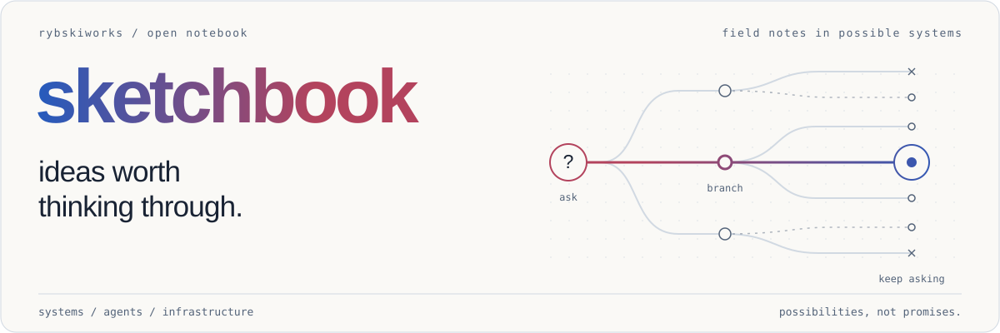
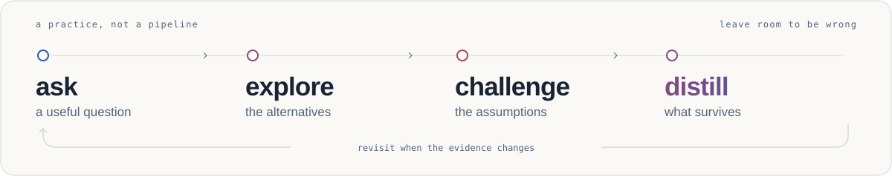

<a href="https://github.com/rybskiworks">
  <picture>
    <source media="(prefers-color-scheme: dark)" srcset="assets/sketchbook-dark.svg">
    
  </picture>
</a>

  <a href="#on-the-desk">explorations</a> /
  <a href="https://github.com/rybskiworks/sketchbook/issues">open questions</a> /
  <a href="CONTRIBUTING.md">add a sketch</a> /
  <a href="README.agents.md">agent map</a>

**A shared notebook for rybskiworks.** Ideas, architectural sketches, research notes, and technical explorations that deserve a durable home before they deserve a project of their own.

Explore alternatives, make assumptions explicit, and leave enough evidence for the next person to pick up the thread. The notes are exploratory, not accepted specifications.

## on the desk

| Exploration | The question |
| :--- | :--- |
| [Compartmentalized NixOS workstation](explorations/compartmentalized-nixos-architecture-seed.md) | Can isolated application environments still feel like one coherent desktop? |
| [Compartmentalized NixOS enablement](explorations/compartmentalized-nixos-enablement-roadmap.md) | Which runtime, graphics, firmware and policy integrations turn the workstation sketch into testable building blocks? |
| [Shared Nix store fabric](explorations/shared-nix-store-microvm-fabric.md) | How much immutable state can a microVM fleet share without sharing authority or mutable state? |
| [Microsandbox storage and memory enablement](explorations/microsandbox-storage-memory-enablement.md) | Which CoW, KSM and reclamation primitives already exist, and what must reach Workestrate to use them safely? |
| [Workestrate testing philosophy](explorations/workestrate-testing-philosophy.md) | How do we explore a stateful system's failures instead of merely testing its happy paths? |
| [Yggdrasil: agent-directed branching](explorations/yggdrasil.md) | Can an agent revisit an earlier world while retaining useful lessons from the futures it explored? |
| [A continual RLM on DeepSeek Harness](explorations/continual-rlm-on-deepseek-harness.md) | What would a Prime-style recursive, continually improving agent look like on DSH's plugin architecture? |

The [reading guide](explorations/README.md) connects these threads. The [issue tracker](https://github.com/rybskiworks/sketchbook/issues) holds questions that have not become notes yet.

## how ideas develop

<picture>
  <source media="(prefers-color-scheme: dark)" srcset="assets/thinking-loop-dark.svg">
  
</picture>

A useful question is enough to start an issue. A useful investigation deserves a note. A decision or implementation belongs with the project that owns it, linked back here for its rationale.

## leave a useful trail

Keep one subject per note in `explorations/`, link related work, distinguish proposals from verified capabilities, and record what would change your mind. Small corrections and unfinished but well-framed ideas are welcome.

Use the [exploration template](templates/exploration.md) for a starting point, not a form to fill mechanically. See [contributing](CONTRIBUTING.md) for the lightweight conventions and local checks.

Repository maintenance and staged protections are documented in the [governance guide](docs/repository-governance.md).

---

Working notes, not marching orders.
