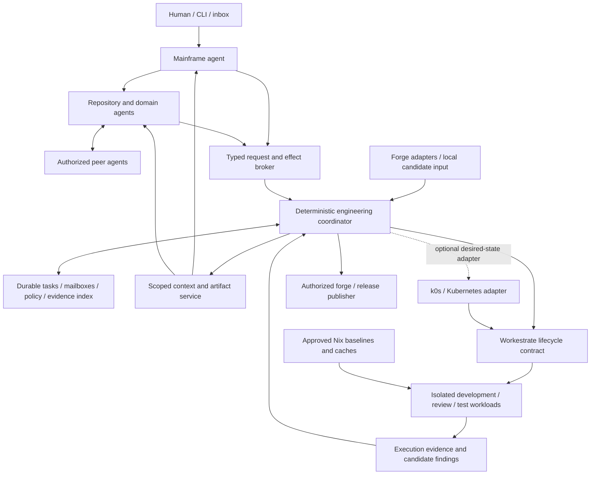
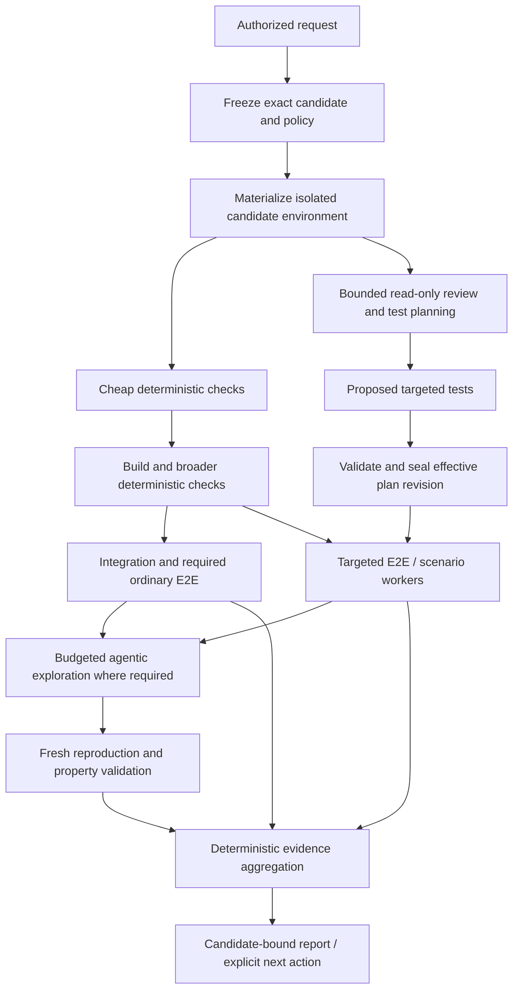

# Local agentic engineering control plane

[Reading guide](README.md) | [Workestrate investigation #66](https://github.com/rybskiworks/workestrate/issues/66)

**Status:** detailed exploratory specification and discovery PRD, not an accepted architecture, implemented API or authorization to deploy.

**Date:** 2026-09-16. **Origin:** Georg Rybski's design discussion, drafted with ChatGPT. **Reference deployment:** operator-owned Linux/NixOS machines, local execution and storage, Workestrate-compatible isolated workloads, and an optional Kubernetes integration with k0s as the reference distribution.

**Canonical document path:** `explorations/local-agentic-engineering-control-plane.md`. The maintained post-merge location is this path on sketchbook `main`. Before merge, use the documentation PR or its immutable commit permalink recorded in Workestrate #66. Merging this document does not close the implementation investigation.

**Evidence boundary:** this proposal connects existing repository explorations and primary upstream documentation consulted on the date above. Repository guidance, catalogues, relevant sections of Yggdrasil and the continual-RLM note, and the Kubernetes control-plane PR were inspected. It is not a fresh source audit of every runtime, harness or forge. No performance, security, VM recovery, memory-sharing or cross-forge experiment was performed. All new records, APIs, policies, examples, milestones and acceptance requirements below are proposals.

## Reading routes

- **Product and architecture:** sections 1-6 explain the human-facing mainframe, domain agents, ownership and the intended division between intelligence and deterministic machinery.
- **Agents and context:** sections 7-10 specify delegation, peer communication, memory, selective context access, continuation and recovery.
- **CI and warm execution:** sections 11-19 specify admission, candidates, progressive checks, agentic E2E, immutable environments, caching, scheduling and k0s.
- **Trust and evidence:** sections 20-24 cover security, evidence publication, cross-repository work, operation and failure semantics.
- **Implementation:** sections 25-29 define interfaces, alternatives, milestones, acceptance tests, measurements and unresolved decisions. Section 30 records sources.

## 1. The product being proposed

I want one place to send substantial engineering work and get a coherent result back. I do not want to manually start several coding sessions, move context between them, decide which reviewer should see which output, provision tests, chase failures and remember which agent owns the next step.

The proposed system is a **local-first engineering control plane with a mainframe agent as its principal human interface**. The mainframe delegates to repository or domain agents, which can themselves request bounded isolated workloads. Those workloads can contain full agents undertaking significant work, not only short model calls. A domain agent can retain responsibility for an implementation through development, review, testing, repair and follow-up.

The same execution fabric supports ordinary development, deterministic CI, review, targeted E2E, controlled adversarial exploration and research. An agent handles ambiguity and routing. Deterministic services retain authority over identity, authorization, budgets, lifecycle transitions, minimum verification requirements and external publication.

The intended interaction is:

> Implement the launch-generation change, coordinate the affected repositories, verify the security boundaries and come back with the candidate, evidence and unresolved decisions.

Not:

> Start these six sessions, paste this transcript into that one, manually restart the failed worker and remind the reviewer to retest the new commit.

"Mainframe" is a working name for the interface and coordination role. It does not require one permanent process, a monolithic application, special host privilege or one agent owning every repository forever.

## 2. Goals, constraints and non-goals

### 2.1 Required outcomes

**One logical front door.** The human can submit a goal, inspect progress, redirect work, pause a task tree, review evidence and approve an external effect without managing individual sessions.

**Durable responsibility.** Repository/domain agents retain task ownership, memory and references across long work periods. They may remain resident, sleep or restart on demand. The scheduling policy must not change the meaning of their identity.

**Substantial isolated delegation.** An agent can request another authorized workload for implementation, research, review, testing or integration. Recursive delegation has explicit aggregate limits and never implies nested host administration.

**Selective context transfer.** Results cross boundaries as bounded briefs and evidence references. An authorized recipient can inspect the underlying recorded material when a summary is insufficient. Full transcripts are not broadcast by default.

**Locally owned development and CI.** The reference deployment uses operator-owned machines, hot immutable dependencies and disposable private execution state. No cloud executor is required. Model inference may be local or use explicitly permitted external providers; this is independent of where CI runs.

**Progressive verification.** Cheap checks should reject unsuitable candidates before expensive work. Review can run concurrently and propose targeted tests. Required gates, execution and final status are not an LLM opinion.

**Forge independence.** Candidates, plans, agent memory, execution and evidence belong to the local system. GitHub, GitLab, Forgejo and local Git are adapters or entry points, not mandatory workflow engines.

### 2.2 Non-goals

This is not a new foundation model, mandatory replacement for Codex or another harness, universal session-state interchange, a rewrite of Workestrate, a new hypervisor, an assumption of complete RAM forks, or a promise of unlimited agents on one machine.

It does not require autonomous merging or deployment. It does not promise that an LLM-generated review proves correctness, that a signed artifact is safe, that Nix makes all executions deterministic, or that a microVM makes testing its own hypervisor harmless.

Cloud portability is a later option, not a reason to weaken the local-first design. The initial system must be useful without Kubernetes, semantic vector search, multi-host failover or live-memory restore.

## 3. Relationship to existing explorations

This document owns the **engineering orchestration product**, including the human workflow, durable agent relationships, forge-neutral candidates, CI plans and evidence routing. It consumes lower-level capabilities rather than redefining them.

- [Yggdrasil](yggdrasil.md) owns exploration branches and the distinction between resettable execution, agent continuation, retained knowledge, supervisory ledger and external effects. Reuse that distinction here. A conversation fork is not a VM checkpoint.
- [Shared Nix store fabric](shared-nix-store-microvm-fabric.md) investigates immutable store generations, private overlays, builders and the separate storage/memory-sharing mechanisms. This proposal adds CI consumers, baseline rollover and evidence requirements above that work.
- [Compartmentalized NixOS workstation](compartmentalized-nixos-architecture-seed.md) is an adjacent consumer of generic isolation and lifecycle services. The engineering system is not a requirement to turn Workestrate into an operating system.
- [Workestrate testing philosophy](workestrate-testing-philosophy.md) provides the direction for independent observers, stateful testing, fault injection, replay and minimization. This proposal turns those ideas into scheduled review/CI work.
- [Continual RLM on DeepSeek Harness](continual-rlm-on-deepseek-harness.md) investigates one possible cognitive substrate and knowledge layer. The engineering coordinator must not depend on that specific harness or its persistent Python state.
- The [Kubernetes lifecycle PR, sketchbook #32](https://github.com/rybskiworks/sketchbook/pull/32), and [Workestrate #44](https://github.com/rybskiworks/workestrate/issues/44) own generic lifecycle integration, placement, reservations, fencing and capability reporting. Its inspected draft is pinned at [R1]. This document sits above it and does not implement a competing VM registry.
- The parallel [fleet/comparison draft, sketchbook #33](https://github.com/rybskiworks/sketchbook/pull/33), is related implementation investigation. Its PR metadata was inspected; its runtime claims were not independently validated here. Reconcile ownership and preserve all catalogue additions when integrating these parallel documentation PRs.

Sketchbook `main` was inspected at `3c75279220bfc123048ad076065adbda86be0e49`. Existing notes are evidence snapshots, not proof that their proposed runtime capabilities now exist. Re-audit the selected Workestrate/runtime/Nix/harness tuple before implementation and record immutable pins in the implementation ADR.

## 4. Architecture and the authority boundary



The diagram shows **alternative integration paths**, not permission for the standalone coordinator and Kubernetes controller to independently manage the same workload. Every runtime slot has one declared desired-state owner.

Two loops cooperate:

1. The **deterministic loop** authenticates inputs, records state, validates requests, admits resources, advances ready DAG nodes, reconciles runtime observations, checks evidence and publishes authorized effects.
2. The **agent loop** interprets goals, proposes decomposition, investigates ambiguous failures, selects additional tests, communicates with peers and proposes repairs or escalation.

The deterministic loop must remain operable when every model provider is unavailable. It can keep admitted tests running, deny unauthorized requests, cancel work and explain missing evidence without asking a model.

A supervisor's administrative role means it can request a bounded set of operations. It does not mean it receives a kubeconfig, Docker socket, host Nix daemon socket, cache signing key or forge administrator credential.

## 5. Ownership and deployment units

The following are logical boundaries, not a requirement to deploy nine independent services on day one.

| Component | Owns | Must not own implicitly |
| --- | --- | --- |
| Human interface | Goals, approvals, explanations and interruption | Runtime credentials or hidden automatic approval |
| Agent coordinator | Tasks, routing, agent identities, mailboxes and plan versions | Host-level workload truth or a second policy compiler |
| CI engine | DAG dependencies, result aggregation, retries and candidate validity | Model-specific conversation internals |
| Context service | Evidence references, authorized projections, indices and retention metadata | Permission to publish source material externally |
| Admission/effect broker | Capability checks, operation receipts, revocation and publication requests | Trust in instructions embedded in repository content |
| Workestrate authority | Launch identity, effective runtime policy, local reservations and actual execution | Repository-specific notions of LGTM or merge eligibility |
| Optional Kubernetes adapter | Declared workload intent and reconciliation for its owned slots | Automatic scheduling of arbitrary external VMs |
| Baseline/cache service | Approved immutable artifacts and publication policy | Trusting every PR output because it has a hash |
| Forge adapter | Provider identity, events, refs, statuses, comments and allowed effects | The canonical engineering DAG or all durable agent memory |

The initial deployment can combine the coordinator, CI engine and metadata storage into one supervised process, with a narrow broker boundary and a Workestrate integration. Durable state remains independent of agent process survival.

A separate orchestration repository is a provisional preference, not a repository created by this specification. Workestrate should gain only the generic integration seams it actually needs. A Go Kubernetes adapter can remain separate from the orchestration core. Harness adapters may use their native language. An ADR must select ownership and language based on integration experiments, not force a Go/Rust/TypeScript/Python rewrite of everything.

## 6. Durable records and identifiers

Every record has a schema version, immutable identity, scope, creation provenance and an explicit state owner. Mutable records additionally have a revision used for conditional updates. Names and examples are illustrative, not an installed API.

| Record | Required identity and content |
| --- | --- |
| `AgentRecord` | Agent ID, role, scope, owner, goal references, mailbox, memory references, desired activity policy and current incarnation reference |
| `AgentIncarnation` | Agent ID, launch ID/generation, runtime epoch, harness version, model configuration, continuation capability and fenced writer lease |
| `Task` | Task ID, parent, accountable owner, dependencies, requested outcome, source/candidate references, budget, deadline, state and acceptance criteria |
| `Candidate` | Repository identity, exact base/head revisions, integration mode, resulting source identity, resolved inputs and candidate digest |
| `BaselineEpoch` | Approved source baseline, image/kernel/runtime tuple, store generation, toolchains, qualified artifacts and publication status |
| `ContextRef` | Source identity, immutable event/artifact range, scope, classification, source revision, retention state and projection provenance |
| `PlanRevision` | Candidate, approved policy digest, mandatory gates, admitted additions, test definitions, dependencies, budgets and closure state |
| `Execution` | Plan node, exact inputs, attempt ID, workload identity, runtime profile, limits, observations and result classification |
| `Finding` | Claim, violated property, candidate, evidence, proposed reproducer, verification attempts and disposition |
| `EvidenceBundle` | Candidate/plan/input digests, observed executions, reports, trusted observer identity, coverage limits and integrity metadata |
| `OperationReceipt` | Caller, request ID/digest, authority epoch, target, outcome or uncertainty, and external-effect reference |

A repository's local ID must not be its current URL or display name. A forge instance plus its repository identifier maps to that local ID. Fork repositories and mirrored repositories need explicit mappings, not guessed equivalence.

A task is not a candidate; a candidate is not a VM; a VM launch is not an agent identity; a test attempt is not a test definition. Preserving these distinctions is necessary for supersession, recovery and evidence reuse.

## 7. Mainframe, domain agents and bounded delegation

The mainframe receives human goals and routes substantial work. Domain agents can be assigned to a repository, a subsystem spanning repositories, or a durable role such as research, security or integration. Their topology is configurable. Do not create a permanent agent per repository merely because the repository exists.

An agent can request a child with a task, allowed workload profile, exact source/environment references, bounded context grant, acceptance criteria, deadline and budget slice. Admission returns a task/operation reference before execution begins. Accepted, queued, running and ready are distinct states.

The child's request permissions are an explicit attenuation of its delegation, not a copy of the parent's credentials. Bound at least total descendants, concurrently running descendants, depth, spawn rate, CPU time, RAM reservations, storage, model usage, wall time and external effects. Reserve shared family budgets atomically. Two children must not each spend the entire balance after reading the same stale counter.

Example intent:

```yaml
# Proposed request vocabulary, not runnable Workestrate configuration.
kind: DelegateTask
parentTask: task-generation-review
profile: approved-integration-worker
scope: project-runtime
candidateRef: candidate-C
context:
  viewRef: view-generation-contract
  maxImportedTokens: 3000
acceptance:
  propertyRef: invariant-stale-launch-denied
  evidenceProfile: external-observer-v1
limits:
  maxChildren: 2
  maxDepthBelowThisTask: 1
  maxConcurrent: 2
  maxWallMinutes: 45
publication: propose-only
```

The numeric limits are examples. Operator policy sets actual values. A child may request more resources, but cannot enlarge its own grant or ask a peer to evade its ancestry budget.

Provisioning is host-mediated. A guest asking for a sibling or descendant does not need to start a container engine or Kubernetes inside itself. Nested virtualization is a separately authorized test capability, not the ordinary mechanism for recursive agent delegation.

## 8. Mailboxes, peer communication and responsibility transfer

Communication should support parent/child control, peer consultation and explicit handoff without forcing the mainframe to forward every message.

An envelope contains message ID, sender identity and current authority, recipient, project/task scope, causal reference, candidate/revision where relevant, typed intent, bounded body, artifact references, expiry and reply budget. Useful types include `Question`, `Finding`, `DependencyNotice`, `ReviewRequest`, `HandoffProposal`, `HandoffAccepted`, `PlanChanged` and `HumanDecision`.

An at-least-once delivery contract is acceptable. Durable inbox/outbox records, deduplication and conditional state transitions must make redelivery safe. Acknowledge durable receipt separately from successful processing. Preserve per-task causal references; do not invent a global total order across all agents.

Peer messages carry information or requests, not ambient authority. Being allowed to send a finding to a repository agent does not authorize that agent to execute arbitrary commands or reveal its entire memory. The receiver evaluates any requested action under its own current policy and task context.

Responsibility transfer is explicit:

```text
A proposes handoff -> B accepts with expected task revision
  -> coordinator commits new accountable owner -> A observes receipt
```

Until acceptance commits, A remains accountable. A peer conversation cannot silently orphan a task. Parent termination policy must say whether descendants are cancelled, reparented or allowed to finish under existing grants. A deliberate stop must not be treated as a crash requiring resurrection.

Prevent message storms with hop limits, causal-chain accounting, per-agent rate limits and deduplicated findings. Reciprocal dependency cycles become an actionable blocked state, not endless A-to-B-to-A delegation. Unanswerable questions or mutually inconsistent contracts are routed to the accountable owner, with escalation to the human only when required.

## 9. Selective context and memory

The parent does not need to ingest the child's full history. It needs a reliable current brief plus the ability to inspect scoped evidence when necessary.

Maintain three representations:

**Recorded trajectory.** Append-only observed messages, tool requests/results, files, decisions and execution references, subject to redaction, encryption and retention policy. This is recorded evidence, not access to a model provider's hidden reasoning, activations or internal cache.

**Resolution or milestone brief.** A bounded record of goal, outcome, decisions, assumptions, changed artifacts, tested properties, negative results, failures, uncertainties and source references. Generate it at a meaningful task boundary or explicit checkpoint, not after every token or continuously by re-summarizing the previous summary.

**Searchable projection.** A rebuildable index over permitted source material. Begin with metadata filters, exact lookup and full-text search. Add semantic retrieval only if measured retrieval quality justifies it. The index is not the source of truth.

Example reference:

```yaml
kind: TaskBrief
agent: agent-ssh-domain
candidate: candidate-C
status: Blocked
outcome: Implementation produced; reconnect invariant not established.
claims:
  - text: A stale generation appeared to retain access after reconnect.
    kind: candidate-finding
    evidenceRefs: [event-range-E, trace-T]
unresolved:
  - Independent reproduction is pending.
artifacts: [patch-P, reproducer-R]
contextRef: context-task-C-at-revision-17
```

The mainframe can request an exact event range, a bounded search, a relevant artifact or a new answer from the same agent. These are different operations. A retrospective query over historical evidence is read-only. Sending the child a new task can execute work and needs an action grant.

Every generated projection records source ranges/digests, candidate applicability, summarizer/harness version, omission/truncation status and the applied access policy. It must expose contradictory observations rather than smoothing them into one confident conclusion. Unknown or expired source material must remain visibly unavailable, not be reconstructed as fact.

Authorization precedes retrieval and is rechecked when dereferencing a result. Search counts, snippets, embeddings and cached summaries must not leak another project's existence or content. A recipient of a derived summary needs permission for its included sources or an explicit declassification decision. Summarization is not a confidentiality boundary.

A child task's completion should normally push only a compact result and reference. The parent pulls deeper material lazily. Domain agents may inspect authorized peer evidence directly; the root agent is not a mandatory data-transfer bottleneck.

## 10. Resident, sleeping and recovered agents

Persistence is a property of logical state, not an obligation to keep an LLM process alive. Support policies such as `Resident`, `WakeOnMailbox` and `Manual`, with bounded idle time and explicit retention.

The minimum durable agent state is its identity, accountable tasks, mailbox, recorded continuation material, memory references, workspace references and operation ledger. A harness process may be replaced while that identity remains.

Recovery must report which operation occurred:

- **Reconnect/adopt:** attach to a proven surviving incarnation without starting another writer.
- **Process restart:** restore supported harness/session state and reconcile interrupted operations.
- **Reconstructed continuation:** start a new invocation from recorded task state and evidence, explicitly not an exact restoration of the old process or model internals.
- **Cold boot retained workspace:** restore declared durable files and re-establish policy/identity.
- **Complete checkpoint restore:** only when the runtime advertises and passes the required RAM, CPU, device, disk and identity contract.

Only one incarnation may mutate an agent's authoritative state at a time. Use fencing that the state and effect endpoints actually enforce. A lease expiry or missing heartbeat alone is not proof that the old process cannot act.

Record intent before effect and reconcile receipts after failure. A timed-out request to create a workload, push a branch or publish a comment may have succeeded. Do not blindly replay it with a fresh request ID. Unknown outcomes become `NeedsReconciliation` until inspected or safely resolved.

Recovery cannot refund spent model tokens, restore revoked grants, resurrect expired credentials or erase externally published effects. These remain outside resettable guest state, consistent with Yggdrasil's supervisory ledger.

## 11. Forge-neutral ingress and deterministic admission

A locally hosted forge-native runner is not sufficient for forge independence. Independence requires the workflow graph, policy, state and execution contract to live outside GitHub Actions, GitLab CI or Forgejo Actions.

Supported entry points can include authenticated webhooks, an explicit CLI request, a local agent request, a schedule or a minimal forge-native workflow that submits a candidate. A forge adapter translates provider events into local vocabulary rather than leaking provider YAML throughout the core.

GitHub documents `ready_for_review` as a pull-request activity and normally uses a pull-request merge ref for its `pull_request` workflow context. Those are useful adapter inputs, not universal forge semantics. [G1]

Admission is deterministic and occurs before untrusted source evaluation or model invocation:

1. Authenticate transport and delivery using the provider's documented method. GitHub documents webhook signature validation; GitLab and Forgejo have their own webhook configuration and verification contracts. Do not assume identical headers or interchangeable signatures. [G2], [F1], [F2]
2. Deduplicate the delivery and parse only bounded, expected event/command forms.
3. Resolve repository, PR/MR, triggering actor and current candidate state through the authorized adapter.
4. Authorize the specific operation under current local policy. Distinguish PR author, event sender, command author and approver. A maintainer's name inside a comment is not identity evidence.
5. Bind admission to the exact source, policy revision, permitted workload class, budget and expiry.
6. Persist the admission/denial receipt before scheduling work.

Ready-for-review is an event, not permission by itself. An explicit `/ci full` command is a typed request only after its author and scope are verified. Edited/deleted commands and later permission revocation need defined handling. A PR push must not silently inherit an approval granted to different code unless the policy explicitly grants that broader authority.

The baseline can reject all unsolicited external execution and require a maintainer grant. A later external-contributor lane needs separate conservative quotas, egress and approval policy. Denial must launch no model, evaluator or guest beyond the bounded ingress processing itself.

## 12. Exact candidates and freshness

Define a candidate from immutable inputs, not a mutable branch name:

```text
candidate identity = digest(
  repository identity,
  exact base revision,
  exact head revision,
  integration mode and resulting source identity,
  resolved dependency/submodule/LFS inputs,
  environment specification,
  policy revision
)
```

The digest format must specify canonical serialization and algorithm. Do not confuse a Git commit identifier with a universal content digest or omit the hash algorithm from external records.

Distinguish at least `HeadOnly`, `ProspectiveMerge` and `IntegrationSet` candidates. Head-only feedback is useful during development but must not be advertised as merge-result verification. Prospective merge construction must record the exact base/head, merge strategy and result tree or commit. A conflict produces a clear blocked result, not a green check on the unmerged branch.

Forge-provided merge refs can be used when qualified. Locally constructing a merge needs to match the repository's intended merge semantics closely enough for the property being tested. Rebase, squash, merge queues and multi-repository releases need explicit adapter/plan handling.

An already-local development workspace is a cache opportunity, not canonical input. The baseline admission path accepts committed revisions. A later dirty-workspace mode must archive every included file, untracked file and relevant metadata into an immutable source manifest and label the result non-publishable until mapped to a committed candidate.

New code or a relevant base update creates a new candidate. Old results remain historical evidence but cannot turn the new candidate green. Cancellation of superseded work is best effort; results arriving afterward are retained under the old identity and barred from current publication.

Before publishing readiness or requesting merge, recheck exact candidate identity, required evidence and policy validity. If the forge lacks an adequate conditional merge operation, require an external lock or human action rather than claiming an atomic check-and-merge guarantee.

## 13. Progressive CI as a dependency graph

The pipeline is a DAG, not one enormous sequential script and not an unconditional fan-out. Stages below are cost classes; measured cost and prerequisites determine actual ordering.



A typical progression is admission; formatting/static checks and cheap units; compilation/Nix build checks; integration and ordinary E2E; review-selected E2E; bounded adversarial or stateful exploration; independent reproduction; final aggregation. A compile step is not necessarily cheap, and unit tests may require it. A Nix evaluation may trigger builds under some configurations, so it is not automatically an inexpensive trusted precheck. [N1]

Run read-only review alongside cheap CI when capacity and expected usefulness justify it. Apply a cancellation/early-exit policy when cheap checks fail. Review may still be valuable for a failed candidate, but spending the whole exploration budget after a trivial formatting failure should not be the default.

Every node declares dependencies, exact inputs, execution profile, trusted observer, resource limits, timeout, retry semantics, cache policy, evidence schema and failure classification. Expensive nodes wait for the gates that make their results meaningful. Independent nodes may run concurrently on separate workers.

Final success means every required node has acceptable, applicable evidence under the sealed plan. Missing, cancelled, unknown, timed-out, infrastructure-failed and unsupported are not synonyms for success. An intentional policy skip must have a recorded reason and must be legal for that specific gate.

## 14. Reviewer-generated testing intent

The review agent should do more than emit LGTM or concerns. It should identify changed behavior, affected contracts, uncovered risks and a structured proposal for additional verification.

Its input can include the exact diff, relevant specification, approved test catalogue, policy floor, dependency map and available execution profiles. Candidate-controlled prose is untrusted data. The reviewer has no authority to change the policy revision or certify its own tests.

```yaml
# Illustrative proposal, validated before any resource is allocated.
kind: TestIntent
candidateRef: candidate-C
policyRef: policy-P
hypotheses:
  - property: stale-launch-must-not-authorize
    rationale: Reconnect now crosses a launch-generation transition.
    sourceRefs: [diff-range-D, contract-section-S]
requestedTests:
  - catalogueId: ssh-reconnect-after-generation-change
    profile: approved-vm-e2e
    repetitions: 3
  - generatorTask:
      goal: Construct a minimal client that attempts stale-generation reuse.
      implementationMutation: forbidden
      output: reproducer-and-oracle-proposal
limits:
  maxAdditionalWorkers: 3
  maxWallMinutes: 30
```

The effective plan is the union of immutable policy requirements, repository/dependency rules and validated reviewer additions. An agent may suggest a different ordering or more testing. It may not remove required tests, weaken an oracle, relabel a failure as success or waive a security gate.

Validation checks catalogue identifiers, source applicability, available capabilities, command/template restrictions, test-definition provenance, environment access, budgets and dependency cycles. Arbitrary generated test code is allowed only in the untrusted test-author/execution lane, not embedded as host shell commands in the control plane.

Plan generation must terminate. Give review a deadline and explicit completion state, then seal a plan revision. Later findings produce a new revision and invalidate readiness as required. A publication race cannot ignore newly admitted mandatory work. Late optional experiments need a policy-defined cutoff rather than making every candidate perpetually unfinished.

A reviewer outage has an explicit outcome: deterministic-only feedback, pending required review, or an authorized fallback reviewer. It never fabricates an approved test plan. Budget exhaustion similarly means pending, failed or waived by an authorized human, not pass.

## 15. Agentic E2E and independently meaningful findings

Agentic testing supplements ordinary deterministic tests. It searches for behaviors the author and fixed suite did not anticipate, using approved fixtures and isolated environments.

Separate roles even when implementations initially share a harness:

- The **planner** proposes properties and scenarios.
- The **test author/explorer** writes clients, scripts or browser actions and gathers candidate observations without modifying the target implementation.
- The **execution observer** records actual events under a trusted test protocol.
- The **verifier** evaluates the claimed property and attempts reproduction in a fresh environment.

For browser E2E, capture the candidate build, browser/tool version, initial fixture state, relevant actions, trace/screenshots when permitted, externally observed results and reset method. The narrative "I clicked it and it worked" is not the evidence contract.

For systems E2E, capture the effective runtime tuple, launch identities, network/egress profile, topology, injected failures, relevant host/guest observations and invariant under test. Examples include stale-generation reconnect, cancellation races, broker restart, mismatched identities and nested-workload handling in an authorized disposable laboratory.

The target should be immutable to the test worker where practical. No access to hidden reference expectations, evaluator implementation, score files or release credentials should be granted merely because the worker is a test agent. The worker may write its own fixtures and reproducer, but those remain untrusted artifacts.

A candidate finding becomes confirmed only when the actual observation is established and the claimed expected behavior is justified by an accepted property, requirement or explicit human decision. Reproducing a deliberately wrong assertion twice does not prove a product defect. Different model instances do not guarantee independence if they share the same flawed test or assumption.

Record states such as `Candidate`, `Reproduced`, `PropertyValidated`, `Confirmed`, `Inconclusive`, `Rejected`, `Fixed` and `RetestPending`. Infrastructure failure, oracle error and target failure must remain distinct. A probable severe issue can block publication pending investigation without being misrepresented as confirmed.

Once a failure is understood, minimize the reproducer and propose a deterministic regression test through normal review. Keep both successful and unsuccessful reproduction attempts, the seed/timing conditions where applicable, and the reason for the final disposition.

## 16. Immutable warm baseline epochs

The operator's machine may already contain the toolchains, dependencies, repositories and a built mainline project. Reuse that work without inheriting arbitrary developer state.

A baseline epoch is an immutable, qualified environment manifest:

```yaml
kind: BaselineEpoch
id: epoch-E
source:
  repositoryRef: repo-runtime
  mainRevision: exact-reviewed-revision
construction:
  imageDigest: image-I
  flakeLockDigest: lock-L
  nixVersion: qualified-version
  storeGenerationRef: store-G
runtime:
  backendBuildRef: runtime-R
  kernelRef: kernel-K
  capabilityReportRef: capabilities-Q
contents:
  toolchainClosureRef: closure-T
  optionalBuildArtifactsRef: build-B
  optionalWorkspaceSeedRef: git-seed-S
state: Qualified
```

No live credentials, customer data, agent mailbox, machine identity, uncontrolled network connection or previous candidate's mutable cache belongs in a general baseline. Image content and workload authority are independent: development and CI may use the same image digest while receiving different mounts, capabilities, egress, tool surfaces and publication grants.

Materialization creates private mutable state, binds the exact candidate and validates effective environment capabilities. Fetching a branch is not enough; the worker must attest which source and outputs it actually executed. A retained mainline binary must not be tested accidentally after checking out new source.

Rollover is publish-and-retain, not in-place mutation:

```text
construct E+1 -> qualify E+1 -> publish immutable manifest
  -> atomically select E+1 for new admissions
  -> retain E while running jobs/checkpoints still reference it
  -> collect E only after retention and ownership conditions are met
```

Rapid mainline changes need not rebuild a giant image each time. Compare layered baseline manifests: a slower-changing OS/toolchain closure, dependency closures keyed to locks, and a source/build overlay for an exact main revision. Choose a new epoch because measured reuse or compatibility warrants it, not merely because a branch pointer moved.

A baseline is an optimization seed, never proof of candidate correctness. A candidate may require a newer lockfile or toolchain; materialization must resolve that exact change or refuse it. Running against the old environment silently is invalid evidence.

## 17. Caching, clean verification and Nix boundaries

Separate the caches by what they actually avoid:

| Layer | Potential reuse | Correctness boundary |
| --- | --- | --- |
| Git objects | Network transfer and object storage | Exact revisions and protected mirror ownership |
| Immutable VM disk/base | Environment construction and disk copying | Private writes and image provenance |
| Nix store/substituter | Realizing already available derivation outputs | Complete inputs, trust policy and applicable store semantics |
| Build-tool incremental cache | Recompilation within qualified tool semantics | Full cache key and isolation from other candidates |
| Guest RAM template | Boot/setup state, if complete restore is supported | Coherent VM state and identity reset contract |
| KSM | Some duplicate anonymous memory | Measured enrollment, sharing and isolation policy |
| Test-result cache | Repeating a qualified test result | Exact evidence inputs, freshness and test cacheability |

Nix distinguishes input-addressed and content-addressed derivation outputs. An ordinary Nix build should not be described as universally content-addressed output caching. Changing source inputs can change derivations and require rebuilding; Nix does not automatically provide the compiler's fine-grained incremental cache. [N2]

A binary cache is a reuse mechanism, not a correctness oracle. Nix documents the trust implications of substituter signing keys. [N3] The proposed system therefore separates untrusted candidate output storage from globally trusted cache publication. Cache signing/promoting happens in a credential-isolated service under explicit policy, not in arbitrary builders or agents. A signature proves attribution/integrity under that key, not that tests were adequate.

Maintain two explicit verification modes:

**Warm feedback lane:** permitted immutable dependency reuse and qualified incremental state provide fast development feedback. Record cache keys and actual hits. Treat the result as scoped to that cache policy.

**Clean candidate lane:** fresh writable workspace, no inherited mutable compiler/project outputs, exact candidate build, approved immutable dependency substitutes, and fresh runtime fixtures. This is not necessarily a full rebuild of every dependency. It removes candidate-local incremental contamination while retaining trustworthy immutable reuse.

A separate rebuild/reproducibility lane can disable selected substitutions or rebuild outputs to compare them. Use it for sampled audits, baseline qualification or critical releases, rather than claiming every warm run proves independent reproducibility.

A cached Nix check result may establish that the same derivation previously succeeded; it does not mean a VM/E2E test physically ran again today on this host. Evidence must distinguish `ExecutedNow`, `ReusedEvidence` and `SubstitutedBuildOutput`. Stateful, host-sensitive or security-boundary tests require explicit fresh-execution policy.

Do not expose a writable shared host Nix database or broad daemon socket to arbitrary guests. Start with per-worker coherent private store/database state and an approved read-only substituter or the separately qualified shared-store contract. Merely mounting `/nix/store` does not establish valid database, registration, GC or guest-memory-sharing semantics.

Untrusted flake evaluation occurs in a bounded isolated environment too. Disable unsolicited flake configuration acceptance, constrain fetches and builds, and do not let evaluation select trusted users, signing keys or host hooks. Nix's configuration documents import-from-derivation and privileged settings; the selected version must be qualified rather than relying on unspecified defaults. [N1]

## 18. Storage CoW, RAM CoW and KSM

These are independent capabilities. The system must remain correct with all sharing disabled.

**Storage CoW** can share immutable disk blocks while giving each worker private changes. It does not imply shared RAM, consistent checkpoints of running services or safe reuse of another job's writable overlay.

**RAM-template CoW** requires an actual qualified runtime capability. A complete template/restore contract includes the captured RAM, vCPU/device state, disks, consistency boundary and post-clone identity process. Generic process fork is not the contract. Fresh launches must not inherit network identities, credentials, active leases or external connections from the template. Reinitialization, entropy handling and guest/kernel compatibility need tests, not just a renamed VM ID.

**KSM** scans enrolled memory for identical pages and merges eligible anonymous private pages, with copy-on-write on later modification. It does not merge host file/page-cache pages. Scanning has costs and savings are workload-dependent. Linux exposes enrollment and operational controls; a project label is not a documented independent tenant merge domain. [L1]

The proposed default is no deduplication across confidentiality boundaries. Do not assume an "untrusted pool" is safe merely because every member is untrusted; mutually distrusting workloads can still carry distinct secrets or data. A host policy must either prove the required separation in the actual mechanism or disable cross-domain merging/use separate hosts.

Admission reserves conservative physical headroom without banking on unobserved future KSM savings. Test mass dirtying, unmerge pressure and baseline divergence. Report committed limits, observed physical use, sharing, memory pressure and eviction/denial separately. KSM benefit must not be double-counted with other shared mappings.

Retain exact image/store/template references for running and resumable workloads. A disk checkpoint and a RAM template may have different compatibility and lifetime rules. A failed restore must not silently cold-boot and label the operation a successful continuation.

## 19. Scheduling and the role of k0s

k0s is a deployment option for Kubernetes control-plane components. Its documentation distinguishes controller and worker roles; controllers do not run a kubelet or accept ordinary workloads by default. [K1] This is separate from the application's mainframe/domain-agent roles. An administrative agent is not a Kubernetes controller merely because it coordinates work.

Kubernetes schedules Pods onto Nodes. Custom resources provide stored structured objects and require controllers for their behavior. Neither a CRD nor a k0s installation automatically schedules external Workestrate VMs, enforces their CPU/RAM accounting or executes this CI DAG. [K2], [K3]

Reuse the ownership alternatives in [R1]: an external-runtime controller with explicit placement/reservations, or a genuinely Pod-backed launcher with qualified lifecycle/accounting. RuntimeClass/CRI integration is a separate implementation choice. Do not use placeholder Pods while unaccounted host VMs independently consume the same resources.

The engineering CI engine owns task dependencies, plan versions, budget admission and result aggregation. The runtime placement layer owns actual host admission. Exactly one resource reservation authority must arbitrate shared capacity. The Kubernetes adapter must not compete with a standalone launcher for the same slot.

Initial single-host scheduling should implement bounded queues, concurrency, cancellation, priorities, deadlines and fairness. Reserve capacity for the control plane and interactive work. A research subtree must not starve required CI indefinitely, and one large nested test must not cause unbounded queue blockage for small jobs.

Later placement can prefer a host with the required baseline, closures, GPU or qualified nesting capability. Locality is a preference after security/capability constraints, not permission to use an incompatible host. Multi-resource reservations must include disk and model budget, not just CPU/RAM.

Measure k0s overhead and operational benefit against the standalone baseline on the actual machine. Do not promise a fixed memory footprint or native workflow scheduling from architecture diagrams. Keep bulk transcripts, traces, artifacts and test logs outside the Kubernetes API; CRDs should contain bounded desired state and references. [K3]

## 20. Security and protected privilege structure

### 20.1 Trust classes

Classify the human/operator, deterministic coordinator, runtime authority, publication/signing services, supervising agents, candidate code, generated tests and external content separately. An authorized submitter does not make all of their code trusted. Reading repository content exposes the reviewer to prompt injection even before any candidate code executes.

The supervisor can propose actions through approved tools. Authorization is enforced again outside the model with current caller identity, scope, budget and policy. Tool output, repository instructions, peer messages and retrieved summaries cannot grant capabilities.

Use synthetic credentials and test data by default. Broker source acquisition and external effects where practical, so general-purpose worker processes do not retain long-lived forge credentials. Model egress is a declared disclosure boundary: source and traces sent to an external provider must be permitted independently of local execution admission.

### 20.2 Separate privileged services from candidate execution

No agent workload receives a general host socket, cluster-admin credential, cache-signing key, unrestricted writable host mount or forge administration token. A reviewer that needs to execute a build requests a separate sandboxed action. It does not run repository scripts in the publisher's environment.

GitHub's secure-use documentation warns that self-hosted runners do not inherently provide clean ephemeral execution and that untrusted inputs can compromise workflows. [G3] The design response here is disposable isolated workers, narrow ingress and effect brokers, and credential-separated status publication. A forge-native workflow must not check out and execute candidate code in a privileged event context merely to trigger this pipeline.

Treat outputs as hostile too. Bound archive sizes, nesting, decompression, filenames, symlinks, terminal escape sequences, HTML and report parser inputs. Extract artifacts in isolation. A successful schema parse is not evidence that a report's assertions are true.

### 20.3 Testing the isolation layer itself

Ordinary untrusted application tests and deliberate VMM/kernel escape research are different risk classes. Testing a candidate Workestrate/backend against hostile payloads must not replace the live isolation layer protecting the coordinator.

Run such tests on a separately bounded disposable laboratory host or qualified outer boundary, with no production signing/publishing credentials. Distinguish the trusted outer observer from the candidate runtime under test. Nested virtualization can help construct a laboratory but is not, by itself, a proven containment guarantee. Require explicit capability and enforcement tests for both outer KVM availability and inner nesting exposure.

This does not forbid adversarial testing. It ensures the test cannot award itself authority over the system that grades it or rely on the unproven boundary being tested to protect important state.

## 21. Evidence, status publication and external effects

A result bundle binds evidence to the exact candidate, policy and sealed plan. Include source/environment identities, baseline reference, test definitions, observer provenance, attempt histories, timestamps, limits, actual versus cached execution, relevant logs/traces and declared gaps.

A content hash makes evidence addressable and integrity-checkable, not correct. An authenticated execution receipt establishes who recorded an observation, not that the observer was independent. Trust claims must identify which components were trusted and which were part of the candidate.

Do not trust a candidate-generated `all-tests-passed.json` as the sole pass criterion. For security-critical properties, use a separately controlled observer, hidden or external assertions where appropriate, and a clean test-definition provenance path. Candidate-owned tests remain useful but are labelled accordingly. Test deletions, skipped assertions and mutated CI definitions are review inputs, not invisible optimization.

The result aggregator verifies completeness and applicability mechanically. It publishes a forge-neutral outcome such as `Pending`, `Running`, `Passed`, `Failed`, `Blocked`, `Inconclusive`, `Cancelled` or `Superseded`, then the adapter maps that to supported provider fields. Unsupported provider distinctions remain explicit in the linked report.

Only the publisher holds the narrow capability for external status/comments or separately approved merge/release operations. Publication requests include candidate, plan/evidence digest, expected remote revision, stable logical status identity and idempotency key. Record intent and receipt; a timeout triggers reconciliation.

Some providers may not offer true idempotent creation or conditional effects. The adapter must report that limitation and reconcile remote objects using stable identifiers where possible. Exactly-once external behavior is not assumed. Never solve duplicate uncertainty by granting an agent permission to delete arbitrary reviews/comments.

Passing tests and review establishes `ReadyForHumanDecision` in the baseline. Automatic merge or deployment would need a separate explicit policy, authorization, forge conformance and audit trail. No provision in this document authorizes it by default.

## 22. Cross-repository tasks and forge portability

A domain can span Workestrate, a runtime fork and nix-tooling, while each repository keeps its own policy and owners. An integration task records an exact repository/revision set and compatibility contracts. Results must be tied to that set, not whichever main branches happen to exist when a later worker starts.

Use dependency notices and typed compatibility questions to coordinate peers. For example, a runtime agent can report a changed protocol to the Workestrate agent, which asks nix-tooling to qualify the new package tuple. The mainframe remains accountable for the human goal without manually forwarding every trace.

Cross-repository completion is a saga of explicit steps, not an assumed atomic multi-repository merge. Record prerequisites, published revisions, pin updates, failure/rollback or forward-repair plans and remaining human decisions. A merged change in repository A does not automatically approve repository B's update.

The forge adapter contract should cover capability discovery, authenticated event ingestion, candidate resolution, source access, current-state lookup, status publication, comments/reviews and optional conditional merge. Separate read and write credentials and declare unavailable capabilities.

Portability includes state export, not only interchangeable runners. Export projects, local repository IDs and mappings, tasks, policy revisions, agent briefs, evidence manifests and artifact references. Keep opaque provider/harness fields in namespaced extension records, not inside canonical identifiers.

Moving GitHub to Forgejo or GitLab can require identity remapping, repository migration, status/approval policy translation and credential changes. The promise is to retain the core plans, execution contract and evidence, not that every migration is one configuration line. GitHub Actions compatibility alone is not this contract.

Qualify portability by replaying equivalent normalized candidate events against a local adapter and a second real forge adapter, comparing the effective plan and evidence acceptance. Differences in approvals, merge queues and status semantics must be explicit rather than silently lowered to a common denominator.

## 23. Operator experience and observability

The human view should answer: what is being worked on, who owns the next step, what is blocked, what has actually been tested, what was merely proposed, how much budget remains and what decision is needed from me?

A useful task card contains the goal, accountable domain agent, current candidate, child work, latest bounded brief, required-gate progress, confirmed versus tentative findings, last meaningful activity, budget consumption and available actions. Raw traces remain accessible through scoped drill-down.

Provide deterministic pause, cancel, revoke and inspect controls that work without a model. Pausing planning is different from stopping currently running tests; stopping a task tree is different from deleting retained evidence. The UI/CLI must make those differences visible.

Maintain a correlated trail from human request to task, agent incarnation, candidate, plan node, workload launch, evidence bundle and forge effect. Record model/harness versions and prompts/configuration needed to interpret an agent decision, within privacy policy. Do not imply this makes model output deterministically replayable.

Measure queue delay, startup/materialization/build/test times, cache behavior, restart count, unknown operations, stale results rejected, finding confirmation rates, model usage and human intervention. Track rates by workload/trust class, not just one aggregate throughput figure.

Limit progress chatter. The mainframe should notify the human about meaningful blocked decisions, budget requests, verified findings and completed outcomes, not every tool call or worker heartbeat. Event coalescing must preserve urgent failures and authority-revocation events.

## 24. Failure semantics, retention and local operation

Use explicit task/workflow states and bounded retries. Useful states include `Queued`, `Running`, `WaitingForPeer`, `WaitingForHuman`, `Blocked`, `Succeeded`, `Failed`, `Cancelled`, `Superseded` and `NeedsReconciliation`. Runtime liveness and task outcome are separate dimensions.

| Failure | Required behavior |
| --- | --- |
| Duplicate webhook or agent request | Return/reconcile the existing admission or operation; do not spend twice |
| Worker crash after launch | Inspect actual ownership and receipts before replacement |
| Coordinator restart | Recover queue/leases/outbox and reconcile surviving work without duplicate authority |
| Forge outage | Retain local evidence and pending publication; do not lose completed work |
| Model outage | Continue deterministic work; visibly block required agent decisions or use an authorized fallback |
| Out-of-order result | Attach to its original candidate/plan; reject stale readiness updates |
| Baseline missing or incompatible | Re-materialize only through a declared mode or block; do not pretend warm restore succeeded |
| Disk/RAM exhaustion | Stop admission, preserve ledger headroom and cancel/evict under explicit policy |
| Ambiguous external effect | Hold and reconcile; never assume timeout means no effect |
| Deliberate stop/revocation | Persist intent so restart/reconciliation cannot undo it |

Separate retention of brief summaries, full traces, source artifacts, disk overlays and resumable checkpoints. Retention references must be durable and race-safe against garbage collection. An epoch being admitted must acquire its retention lease before GC can remove it.

Expired raw evidence makes the corresponding deep inspection unavailable. Keep a tombstone and integrity/provenance metadata where policy allows. Do not claim every summary remains fully auditable forever if its source was intentionally collected.

Local execution still needs backup and restore. Back up durable metadata, policy, required artifacts and encryption-key custody through an operator-controlled process. Test restore consistency. Losing the host may require cold reconstruction; no cross-host checkpoint failover is promised by local persistence.

External webhook ingress is optional. Operators can choose a restricted receiver, an authenticated relay carrying bounded events, or outbound polling with an explicitly weaker event-latency contract. Do not expose the host runtime API directly to the internet just to receive forge notifications.

## 25. Proposed interfaces and implementation seams

Prefer a small versioned protocol with testable semantics over a single giant agent tool that executes arbitrary shell on the host.

```text
submit_goal(goal, scope, budget) -> task_ref
inspect_task(task_ref, expected_revision?) -> task_view
propose_delegation(task_ref, template_ref, context_view, limits) -> operation_ref
send_message(envelope) -> durable_receipt
propose_handoff(task_ref, recipient, expected_revision) -> handoff_ref
query_context(context_ref, filters, token_budget) -> evidence_projection
create_candidate(source_manifest, policy_ref) -> candidate_ref
propose_test_intent(candidate_ref, proposal) -> proposal_ref
seal_plan(candidate_ref, expected_plan_revision) -> plan_ref
request_execution(plan_ref, node_ref, operation_id) -> execution_ref
inspect_execution(execution_ref) -> observed_execution
record_finding(candidate_ref, claim, evidence_refs) -> finding_ref
request_reproduction(finding_ref, approved_profile) -> task_ref
request_publication(candidate_ref, evidence_ref, effect, operation_id) -> receipt
pause_or_cancel(task_ref, mode, expected_revision) -> operation_ref
```

All mutating calls validate current identity, scope and revision outside the model. The caller cannot select an arbitrary observer identity, effective policy, admitted resource amount or success status. Context results have explicit byte/token bounds and do not accept unrestricted filesystem paths or network fetch targets.

The harness adapter should expose start, observe, send/continue, interrupt, export recorded events/artifacts and report continuation capabilities. Backend-native session references may remain opaque. A portable task brief is not a promise that Codex, Pi, Prime Agent or DeepSeek Harness can all resume each other's internal sessions.

The runtime adapter should expose only the generic capabilities already owned by the Workestrate lifecycle investigation: validate/prepare, reserve/start, observe, stop, and qualified checkpoint/restore/fork. Avoid parsing interactive terminal output as the durable protocol. Authenticate remote host/control messages and bind every launch to an operation receipt.

Initial durable storage can be a transactional local database plus immutable artifact files, with explicit writer ownership and backup semantics. Decide between a single-writer embedded database and a service database from measured concurrency/recovery needs. Do not introduce an event bus, vector database, object cluster or workflow engine merely to instantiate every box in the diagram.

## 26. Alternatives and decisions to make deliberately

**Forge-native CI with local runners** is the baseline to beat. It is simpler and retains established collaboration flows, but workflow definitions and provider semantics can remain coupled to the forge. A thin submission/status adapter offers an incremental migration rather than a flag-day replacement.

**Deterministic coordinator without a mainframe model** may already remove much manual work. Build it first and add reasoning only where decomposition, triage or test selection actually helps. Deterministic rules are preferable for identity, limits, required checks and straightforward routing.

**One permanent monolithic agent** is easy to prototype but risks mixing authority, conversations and execution. The proposed separation preserves one interface while allowing isolated domain ownership and recoverable workers.

**Harness-native subagents alone** may implement short delegation but do not establish workload provisioning, cross-process durability, forge neutrality or trustworthy CI. Reuse useful harness features without making their session tree the runtime's authority database.

**Existing durable workflow engines** may provide retries, timers and persisted orchestration. Evaluate one against a small local transactional scheduler before inventing those semantics at scale. Any engine still needs operation idempotency, side-effect reconciliation and the domain-specific trust model described here.

**Kubernetes-native workflow tooling** may reduce orchestration work when execution is genuinely Pod-backed. It does not remove the need to qualify external Workestrate VM placement or context/evidence semantics. Keep k0s optional until its integration benefit is demonstrated.

**Large baked images versus layered baselines** should be chosen through cold/warm measurements, update churn and retention cost. A hot compiler closure may produce most of the benefit without a new full image for every commit.

## 27. Phased implementation and ownership gates

### Phase 0: contracts and baseline measurements

Record the repository/language ownership ADR, current component pins, runtime capability inventory, threat model, fixed policy source, observer contract and candidate format. Measure ordinary local Nix CI with clean workers. Identify where manual routing consumes time. Reuse Workestrate #44 and the existing store/testing investigations.

Exit with an owner-labelled backlog and a small approved contract, not a running autonomous platform.

### Phase 1: one local candidate and deterministic execution

Implement authenticated local submission, exact candidate materialization, fixed DAG, resource limits, durable operation IDs, execution evidence and cancellation on one host. No mainframe model, Kubernetes or RAM fork is required. Add a forge adapter only for reading a candidate and publishing a narrowly scoped result.

Exit when duplicate requests, worker/coordinator restart, stale candidates and denied requests pass the acceptance cases below.

### Phase 2: one useful mainframe/domain-agent loop

Add a human-facing goal, one durable domain agent, bounded delegation, milestone briefs, direct evidence lookup and one read-only reviewer operating alongside cheap CI. Route results and one clarification through durable mailboxes. Qualify restart or reconstructed continuation for one harness.

Exit when the human can complete a substantial task without manually transferring session output, and required decisions remain inspectable and controllable without the model.

### Phase 3: targeted E2E and finding reproduction

Add validated reviewer test intent, immutable plan revisions, an isolated test-author worker, an external oracle and fresh reproducer. Seed a real contract violation, require confirmation, route it to the original developer agent, produce a repaired candidate and rerun the required gates.

Exit when a bad test oracle, candidate-modified report and stale result cannot create a false green or false confirmed finding.

### Phase 4: warm baseline and cache qualification

Add immutable epochs, private overlays, coherent store reuse, cache quarantine/promotion, rollover and GC leases. Compare incremental feedback against clean-candidate verification. Test missing/incompatible baselines and cache poisoning attempts. Storage CoW can be added without RAM CoW.

Exit with correctness evidence and measured startup/build/retention benefit. Keep optimizations disabled when their gain or isolation semantics are not established.

### Phase 5: peers, cross-repository work and another forge

Add explicit handoff, scoped peer messaging, integration-set candidates and a second real forge adapter. Demonstrate equivalent core planning/evidence semantics and documented adapter differences. Export and reimport a project's durable state.

Exit when cross-repository progress is auditable and a forge migration does not require rewriting the internal test DAG.

### Phase 6: optional fleet, k0s and qualified memory mechanisms

Integrate the selected #44 lifecycle path, one placement authority, fairness and explicit multi-host fencing. Add RAM templates or KSM only after their separate qualification gates. Cloud placement remains optional.

Exit when resource accounting and failure behavior are at least as correct as the standalone baseline, with measured operational benefit. Kubernetes installation by itself is not a completion criterion.

## 28. Acceptance tests and experiments

These are proposed black-box gates, not tests claimed to have run.

| ID | Scenario | Required observation |
| --- | --- | --- |
| A01 | Unauthorized ready-for-review event or forged command | Admission denied; no agent/evaluator/worker launched |
| A02 | Duplicate delivery and concurrent identical submission | One logical candidate operation and one budget reservation |
| A03 | Approval for old head followed by new push | Old grant cannot authorize new code outside its declared scope |
| A04 | Candidate changes its policy/tests to skip a mandatory gate | Trusted policy floor remains enforced; mutation is visible |
| C01 | Dirty developer tree differs from committed candidate | Executed manifest matches admitted source, not incidental local files |
| C02 | Merge conflict or base advancement | Blocked/superseded result, never head-only evidence labelled merge-ready |
| C03 | Worker runs an old mainline binary after branch checkout | Artifact/source mismatch detected by the qualified build/observer protocol |
| P01 | Reviewer requests invalid profile, excessive budget or dependency cycle | Proposal rejected without privileged execution |
| P02 | Reviewer finishes late after plan closure | New plan revision or explicit optional disposition; no untracked gate race |
| P03 | Cheap gate fails while expensive work is queued | Expensive dependent work does not start; cancellation policy is observable |
| T01 | Explorer invents a failing assertion inconsistent with requirements | Reproduction alone does not confirm a product defect |
| T02 | Candidate forges test report, edits evaluator or hides a failure | Trusted observer/aggregator refuses unsupported success |
| T03 | Seeded target violation with valid oracle | Fresh reproduction confirms it and repair triggers a new candidate/retest |
| T04 | Flaky observation or infrastructure timeout | Inconclusive/infra classification with retained attempts, not automatic pass |
| M01 | Parent receives a long child trajectory | Bounded brief is delivered; authorized exact drill-down works |
| M02 | Cross-project query, cached summary or peer reference | Unauthorized content and metadata are not disclosed |
| M03 | Summary contradicts source or source expires | Provenance/contradiction or unavailability is exposed |
| D01 | Two children spend the same remaining family budget | Atomic admission prevents aggregate overspend |
| D02 | Peer handoff races with cancellation | Exactly one accountable owner or an explicit reconciled terminal state |
| D03 | Cyclic messages/delegations | Bounded causal chain/rate limits and actionable blocked state |
| R01 | Coordinator crashes after launch, before recording response | Existing launch is adopted/reconciled; no duplicate effective owner |
| R02 | Old incarnation returns after lease expiry | Fenced state/effect endpoints reject stale authority |
| R03 | Harness crash during an ambiguous external operation | Receipt reconciliation; no blind repeated effect |
| R04 | Operator deliberately stops agent/task then restarts coordinator | Stop intent persists; no unwanted revival |
| B01 | Roll baseline while old workers/checkpoints exist | Old epoch retained; new work binds a recorded epoch |
| B02 | GC races with new admission or resume | Retention acquired atomically or admission safely refused |
| B03 | Poisoned incremental/cache artifact | Trust/candidate key prevents promotion or inappropriate result reuse |
| B04 | Warm and clean verification disagree | Difference surfaced and blocks affected readiness pending explanation |
| S01 | RAM-template clone duplicates identity or stale grants | Clone qualification fails; credentials/authority are not reused |
| S02 | All guests dirty shared pages or KSM savings disappear | Admission headroom/pressure policy prevents reliance on imaginary capacity |
| S03 | Host-side isolation test would touch coordinator credentials | Laboratory policy refuses the topology before execution |
| F01 | Forge status request succeeds but response is lost | Reconciliation avoids false failure and uncontrolled duplicate publication |
| F02 | Stale execution completes after a newer candidate | Historical evidence retained; current status remains bound to new candidate |
| F03 | Local and second-forge equivalent input | Same normalized candidate policy/plan, with explicit provider differences |
| O01 | Model provider unavailable | Deterministic tests/inspect/cancel still function; missing review stays visible |
| O02 | Restore metadata and required artifacts from backup | Ownership, retention and pending effects reconcile without replaying authority |

### 28.1 Performance and usefulness measurements

Compare ordinary local CI, the deterministic coordinator and the full agent-assisted loop on the same hardware and representative candidates. Include cold host/cache, warm store, warm disk baseline, qualified incremental state, optional RAM template and optional KSM as separate configurations. Record exact software pins, dataset, concurrency and repeated runs.

Measure queue time, materialization, build, first useful failure, full verification, physical memory, disk retention, CPU/I/O pressure, model tokens/cost and human interventions. Report distributions, not only the fastest run. Separate cache-hit speed from correctness and cold-start behavior.

For test planning, seed known omissions and measure confirmed additional defects, false findings, missed seeded defects, reproduction rate and extra cost. Include a fixed-policy/non-agent planner baseline. More spawned agents or more written tests is not success by itself.

For context routing, test whether a parent can answer source-grounded questions without importing complete histories, including contradictory and obsolete evidence. Measure retrieval accuracy, omitted critical facts, unauthorized disclosure, prompt size and summarization cost. Compression ratio alone is insufficient.

Set numerical acceptance thresholds only after baseline measurements and before evaluating the proposed improvement, to avoid selecting thresholds that flatter one run. The non-negotiable gates are no authority widening, no stale false green, no required-evidence bypass and no fabricated recovery guarantee.

## 29. Open decisions and smallest useful demonstration

The initial ADR must resolve orchestration repository ownership, language, storage/concurrency model, selected harness and supported continuation mode, Workestrate integration seam, observer trust, trusted policy location, baseline construction and publication authority. Later ADRs own multi-host fencing, k0s execution model, RAM-template support and forge-specific merge semantics.

Also resolve how a human withdraws an approval, how long full evidence remains available, which findings block readiness before confirmation, how expensive research is preempted, and when an agent may ask for more budget. These affect behavior and safety more directly than the choice of vector database or dashboard framework.

The smallest meaningful demonstration is:

```text
human submits one goal
  -> mainframe assigns one durable domain agent
  -> domain agent produces an exact candidate
  -> deterministic admission authorizes its review/test operation
  -> private local worker runs cheap checks
  -> read-only reviewer concurrently proposes one targeted E2E test
  -> deterministic planner validates and seals the plan
  -> fresh worker executes against an immutable target
  -> independent observer and fresh reproducer confirm a seeded defect
  -> finding routes back to the original responsible agent
  -> repaired candidate receives fresh applicable verification
  -> human receives one coherent evidence-linked report
```

Interrupt the coordinator during that loop, redeliver an event and push a superseding commit. It must still preserve accountability, budgets, candidate freshness and honest status. Then repeat through another forge adapter without rewriting the internal plan.

That demonstrates the actual product: **one agent interface coordinating substantial, recoverable work across isolated agents and a locally owned verification system**. Warm Nix state, CoW, KSM and k0s are ways to make it efficient and manageable, not substitutes for the contract.

## 30. References and evidence map

Local links above connect the relevant explorations. The following primary sources support the limited factual descriptions of upstream behavior. The detailed product contracts, threat model, example schemas and acceptance gates are proposals of this document, not features attributed to those sources.

- [R1] Pinned sketchbook Kubernetes lifecycle draft inspected for ownership, external-runtime placement, recovery and capability boundaries. Its implementation remains proposed.
- [K1] k0s architecture, controller/worker separation. A deployment reference, not a performance measurement.
- [K2] Kubernetes Scheduler, Pod placement responsibilities.
- [K3] Kubernetes custom resources, controllers and the caution against using the API as bulk application-data storage.
- [N1] Nix 2.34 configuration reference, including flake configuration acceptance, import-from-derivation and privileged configuration boundaries. Version-specific behavior must be requalified.
- [N2] Nix 2.34 derivation reference, input-addressed and content-addressed outputs.
- [N3] nix.dev binary-cache configuration and signing-key trust.
- [L1] Linux KSM documentation, enrolled anonymous memory, copy-on-write and operational controls. No independent tenant-pool security guarantee is inferred.
- [G1] GitHub Actions event reference, ready-for-review and pull-request merge context.
- [G2] GitHub webhook delivery validation.
- [G3] GitHub secure-use reference, untrusted inputs and self-hosted-runner risks.
- [F1] GitLab webhook documentation, to be qualified by its adapter.
- [F2] Forgejo webhook documentation, to be qualified by its adapter.

[R1]: https://github.com/rybskiworks/sketchbook/blob/36c7b0988d8dbbac332a9dab528b19a6d683ebed/explorations/workestrate-kubernetes-control-plane.md
[K1]: https://docs.k0sproject.io/stable/architecture/
[K2]: https://kubernetes.io/docs/concepts/scheduling-eviction/kube-scheduler/
[K3]: https://kubernetes.io/docs/concepts/extend-kubernetes/api-extension/custom-resources/
[N1]: https://nix.dev/manual/nix/2.34/command-ref/conf-file.html
[N2]: https://nix.dev/manual/nix/2.34/store/derivation/index.html
[N3]: https://nix.dev/guides/recipes/add-binary-cache.html
[L1]: https://www.kernel.org/doc/html/latest/admin-guide/mm/ksm.html
[G1]: https://docs.github.com/en/actions/reference/workflows-and-actions/events-that-trigger-workflows
[G2]: https://docs.github.com/en/webhooks/using-webhooks/validating-webhook-deliveries
[G3]: https://docs.github.com/en/actions/reference/security/secure-use
[F1]: https://docs.gitlab.com/user/project/integrations/webhooks/
[F2]: https://forgejo.org/docs/latest/user/repository/webhooks/
