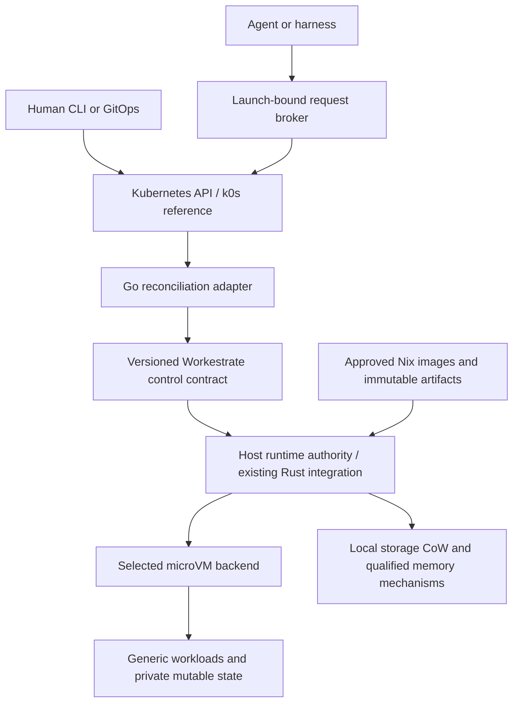

# Workestrate Kubernetes control plane: lifecycle, recovery and branching

[Catalogue](README.md) | [Workestrate investigation #44](https://github.com/rybskiworks/workestrate/issues/44)

**Status:** discovery PRD and candidate architecture, not an accepted implementation specification or an implemented API.

**Date:** 2026-09-15. **Reference deployment:** Linux x86_64, NixOS/KVM hosts, k0s as the first Kubernetes distribution to evaluate. **Proposed implementation:** a Go Kubernetes adapter integrating with Workestrate's Rust lifecycle, policy and runtime interfaces. A separate implementation repository is preferred provisionally; its name and ownership remain an ADR.

**Evidence boundary:** existing repository documents, source-pinned adjacent roadmaps and primary upstream documentation were inspected. No Kubernetes deployment, runtime source audit, Nix build, VM boot, memory-sharing benchmark or recovery experiment was performed for this PRD. All new interfaces, requirements, milestones and acceptance tests below are proposals.

## 1. Product question and recommendation

Can one declarative control surface manage Workestrate workloads on a workstation and across remote hosts, including safe recovery, retained state and eventually agent-directed branching, without replacing the runtime or weakening its security boundaries?

The proposed answer is a Kubernetes operator/control-plane adapter. k0s supplies the initial Kubernetes API deployment; a Go controller reconciles generic workload intent through a versioned Workestrate integration contract. Workestrate remains responsible for configuration provenance, policy compilation, launch identity, credential custody and backend execution. Nix remains responsible for pinned construction and deployment inputs.

The smallest useful result is not a custom CRI implementation. It is a single declared workload that boots on an explicitly selected host, reports actual readiness, survives controller disruption without being duplicated, and stops without being resurrected against operator intent.

The larger direction includes local compartments, cloud-hosted agent/development workloads, bounded child creation and checkpoint-derived branches. Storage CoW, RAM CoW and KSM remain capability-gated runtime optimizations. Installing k0s neither implements them nor makes their combinations safe.

### Related ideas and division of responsibility

The two foundational adjacent explorations are:

- [Compartmentalized NixOS workstation](compartmentalized-nixos-architecture-seed.md): the consumer-facing system, desktop integration and explicit cross-compartment capabilities. This PRD proposes a possible lifecycle/control component, not a replacement for that architecture or a requirement that its smallest deployment run Kubernetes.
- [Shared Nix store fabric](shared-nix-store-microvm-fabric.md): immutable generations, private overlays, builders/caches and distinct storage/memory-sharing mechanisms. This PRD adds placement, reservations, lifecycle references and capability reporting above those mechanisms rather than redesigning them.

[Yggdrasil](yggdrasil.md) is the adjacent consumer for checkpoints, forks and retained learning. It owns agent continuation, knowledge selection and exploration strategy; this layer supplies generic execution and authority contracts. [Workestrate testing philosophy](workestrate-testing-philosophy.md) supplies the fault-injection and independent-observation approach.

Two detailed enablement roadmaps are still in open PRs at inspection time: [desktop/runtime enablement, PR #22](https://github.com/rybskiworks/sketchbook/pull/22) and [storage/memory enablement, PR #31](https://github.com/rybskiworks/sketchbook/pull/31). Their pinned documents are [D1] and [D2]. This note is independently based on main, does not copy or supersede those roadmaps, and must preserve their catalogue entries when the PRs are integrated.

## 2. Evidence and corrections to the initial outline

Workestrate main was inspected at `76fe5e4c42c60fd371e213465ac57af8be0d7973`; sketchbook main at `3c75279220bfc123048ad076065adbda86be0e49`. Workestrate's specification map identifies main as the integration branch after PR #32. Its documentation describes a generic Rust CLI, workload/config ownership, singleton and parallel slots, explicit replacement and separate backend state. It does not establish the networked worker protocol proposed here. [W1], [W2]

The September 13 storage roadmap describes existing lower-level storage mechanisms and a later upstream full-memory adoption path at its own recorded pins. Treat that as a dependency investigation, not proof that today's selected Workestrate package exposes complete checkpoint/fork semantics. Re-audit the final consumed package tuple during discovery. [D2]

Important distinctions:

| Outline shorthand | Contract this PRD actually requires |
| --- | --- |
| Kubernetes schedules our workloads | kube-scheduler schedules Pods. A custom resource needs its own placement/accounting controller or a deliberately Pod-backed execution model. [K2] |
| Set RuntimeClass to libkrun | RuntimeClass selects a configured CRI runtime handler for Pods; it does not turn an external Workestrate API into CRI. [K3] |
| Shared Nix store means shared guest RAM | Shared files or disk extents do not prove shared guest page-cache/RAM pages. The actual filesystem, DAX and VMM mapping path must be measured. [L2], [L3] |
| Fork the VM process | Full-state continuation requires coherent RAM, vCPU/device state, storage, transport and identity handling, not an arbitrary process fork. [D2], [Y1] |
| Enable KSM per tenant | Enrollment is not an isolated tenant merge pool. The host-kernel policy and trust boundary need separate qualification. [L1], [D2] |
| Dead workload: restore it | Lost observation, process failure, host loss, deliberate stop and old-checkpoint restore have different recovery contracts. |
| Nested virtualization off is enforced | Workestrate's current specification explicitly warns that its Linux off flag is not independently enforced confinement. Do not advertise a stronger capability without evidence. [W2] |

## 3. Users, outcomes and scope

**Workstation operator:** declare a development environment or untrusted compartment, start/stop it, keep selected data, inspect its policy, and recover the management plane without losing control of surviving workloads. Desktop brokers and GUI recovery remain owned by the workstation project.

**Remote fleet operator:** submit the same approved workload intent to compatible remote hosts, see why admission failed, inspect logs and effective capabilities, drain a host safely, and know what can actually survive host loss.

**Agent or harness:** request an approved helper, disposable test environment or checkpoint-derived branch within delegated limits. Receive an operation identifier and an honest result without access to host administration or general cluster credentials.

**Runtime maintainer:** add a backend capability through a narrow adapter and common conformance tests without teaching the Go controller VMM pointers, SSH key custody or filesystem implementation details.

Initial non-goals are seamless GUI, cloud-provider provisioning, live migration, HA guarantees, arbitrary cross-host RAM restore, universal undo, a new hypervisor, a new Nix cache implementation, an autonomous publication policy, or a mandatory rewrite of Workestrate in Go. CRI and Pod-native execution are later choices, not inevitable roadmap steps. No Qubes-equivalent security claim is made.

## 4. Candidate architecture and state ownership



This is a responsibility diagram, not a claim that all components already exist. Discovery must locate the existing lifecycle owner and add the smallest stable seam. A new daemon is justified only if the current ownership model needs a durable service boundary; do not add a second registry that competes with the first.

Proposed ownership:

- Kubernetes stores desired declarations, operation requests and bounded status. Controllers derive actions from the current state, not from receiving every historical watch event. Use normal Go controller-runtime/Kubebuilder patterns, work queues, cancellation and bounded retries. [K1], [K6]
- The host authority owns local admission, durable operation receipts, actual launch handles, cgroups, storage references, backend generation and broker bindings. Remote commands cannot bypass its policy or reservations.
- Approved fleet/config repositories own workload definitions and image recipes. Kubernetes initially references an immutable approved template or resolved-plan input; it must not introduce a competing policy merge engine or silently evaluate arbitrary user-supplied flakes on the controller host.
- Artifact storage owns payloads and retention evidence. Kubernetes holds identifiers, hashes, scope and references, not VM RAM dumps, disk images, transcripts or secrets.
- Agent continuation and learned evidence stay outside resettable execution in their owning harness. The forward-moving authority/effect/budget ledger must not be rolled back with a guest.

For a Kubernetes-managed workload, the Kubernetes declaration is the desired-state owner. A local CLI must change that intent through the same authority or request an explicit handoff. A break-glass local stop must create a durable hold/fence so reconciliation does not immediately restart it. Standalone Workestrate workloads retain their existing owner and are not silently adopted by name.

## 5. Kubernetes integration choices

### Candidate A: external-runtime CRDs, the proposed first experiment

The controller manages Workestrate hosts through a structured integration API. A runtime host need not be a Kubernetes worker or run kubelet. The first experiment pins one workload to one configured host and uses an explicitly reserved host resource pool.

This preserves existing microVM execution and avoids CRI work, but it does not inherit Pod scheduling, Pod CPU/memory quota accounting, eviction, NetworkPolicy or storage attachment semantics. Implement and test the needed equivalents explicitly. CRD object-count quotas alone are not compute budgets.

Before multi-host release, choose one durable placement/reservation authority. Filter hosts by authenticated capability reports, storage/restore compatibility and policy; then optionally prefer local templates. The host atomically admits the reservation and launch. A stale controller view cannot overrule local capacity or exclusive ownership.

Hosts shared with ordinary Kubernetes Pods require a documented capacity partition and enforcement. Do not run a VM outside Pod accounting while both schedulers believe they own the same RAM. Dedicated runtime hosts are the simpler baseline.

### Candidate B: Pod-backed VM launcher

A controller can create a Pod that genuinely contains and accounts for a VM launcher, drawing on existing VM orchestration designs such as KubeVirt. Compare this with reusing KubeVirt rather than building a second VM platform. [K7]

Qualification must cover cgroup ownership, device access, launcher termination, backend state, network paths and retained storage. A placeholder Pod reserving resources while an unrelated host process lives elsewhere is not automatically correct accounting or lifecycle ownership. This option may integrate better with Kubernetes, but cannot be presumed compatible with the existing runtime contract.

### Candidate C: CRI or containerd runtime integration

k0s supports an externally managed CRI endpoint and runtime configuration, but the runtime must actually implement the relevant interfaces. [K0] This route requires investigation of Pod sandbox/container lifecycle, images, status, exec/attach/logs, stats, networking and cleanup semantics. It also needs a separate contract for VM checkpoints and branching that CRI does not supply merely through RuntimeClass.

Do not implement a partial CRI adapter solely for a more attractive diagram. Select this only after a concrete Pod-native requirement justifies it.

### Candidate D: standalone supervisor only

Use Workestrate plus a small local desired-state supervisor and no Kubernetes dependency. This remains the baseline for cost, operational complexity and workstation recovery. If Kubernetes adds no useful integration for a single-machine profile, keep it optional rather than manufacturing a cluster requirement.

## 6. Proposed resource and API model

Names and fields are illustrative, not an installed schema. Use generic workloads rather than making agents the only workload kind.

**MVP resources:** `Workload` for one logical runtime slot and `RuntimeHost` for operator-enrolled capacity/capabilities. A host resource is not automatically a Kubernetes Node. Initially templates can come from an approved immutable registry instead of a new CRD.

**Later resources or durable records:** `WorkloadOperation` for checkpoint/restore/fork requests; `Checkpoint` for immutable manifests and retention; `WorkloadSet` or an existing composition mechanism for replicas; delegated request/budget policy for agent families. Do not ship every noun as a CRD before its lifecycle is defined.

A workload spec separates immutable template identity, desired lifecycle state, resources, policy references, placement constraints, persistence and recovery policy. Status records observed generation, actual launch identity, effective capabilities, operation references and conditions with reasons. `Accepted`, `Scheduled`, `PolicyReady`, `GuestReady` and `Recoverable` are different claims.

```yaml
# Illustrative candidate API only; example.org is not a registered project API.
apiVersion: workestrate.example.org/v1alpha1
kind: Workload
metadata:
  name: development-environment
  namespace: laboratory
spec:
  templateRef:
    name: approved-dev-v1
    revision: immutable-template-id
  placement:
    runtimeHostRef: lab-host-a
  lifecycle:
    desiredState: Running
    restartPolicy: OnFailure
    maxAttempts: 3
  resources:
    vcpus: 4
    memory: 8Gi
  persistence:
    onDelete: Retain
  recovery:
    allowedModes: [AdoptExisting, ColdBootRetainedStorage]
    onUncertainOwnership: Hold
  runtimeRequirements:
    hardwareVirtualization: Required
    guestNestedVirtualization: Forbidden
  sharing:
    storageCoW: Prefer
    memoryTemplate: Disabled
    ksm: Disabled
```

`Forbidden` is a requested enforcement property, not a restatement of the current nested off flag. Admission must refuse this example on a backend that cannot prove that property. `Prefer` allows a reported fallback; `Required` must fail rather than silently copy or downgrade. Omitted fields must have conservative, versioned defaults.

Use schema validation and explicit unknown-field handling for security-sensitive fields. RBAC should separate spec mutation, status mutation, operation execution and policy administration. Cross-namespace template, checkpoint or credential references require deliberate authorization; knowing an object name is not access.

Do not use mutable annotations as an unvalidated back door for host paths, shell fragments or backend flags. Resolved plan digests must include configuration provenance and the effective policy revision. A GitOps template update must not imply destructive replacement of a stateful workload without the declared rollout policy.

## 7. Workestrate integration contract

The exact transport is a discovery decision. A versioned protobuf/gRPC API with a generated Go client and Rust server/adapter is a candidate; local Unix sockets and authenticated remote transport can share semantics. A temporary structured CLI adapter is acceptable only if it preserves those semantics without parsing terminal output, supplying broad host environment secrets or executing arbitrary command strings.

Candidate operations are capability discovery, plan/validate, inspect/list, reserve, reconcile/start, stop, operation lookup and observation streams. Checkpoint, restore and fork are added only when a backend passes their contract. Console/exec/log streaming must have bounded buffering and distinguish transport loss from process exit.

Every mutation binds:

- cluster/controller authority, namespace and immutable resource UID;
- logical workload identity, expected launch generation and host/runtime epoch;
- immutable template/plan digest and current policy revision;
- operation ID, request digest, deadline and admitted reservation.

Repeated operation ID plus the same payload returns the same durable outcome. A different payload is a conflict. An RPC timeout does not mean the operation failed or authorize a new launch. Cancellation reports whether work never started, was stopped, completed, or remains indeterminate.

A logical workload, configuration generation, launch incarnation, host boot epoch, checkpoint and branch each have distinct identities. Recreating a Kubernetes object with the same name must not control an old launch owned by a different UID.

The host journal and runtime registry must reconcile after restart against actual process/device/storage observations. PID reuse, a stale DB row or a guessed CID is not ownership evidence. Preserve the existing launch-bound credential context rather than assigning one broker policy to an entire host daemon.

## 8. Reconciliation, fencing and deletion

Proposed normal sequence:

```text
validate intent -> persist operation/reservation -> bind host authority
  -> prepare private state -> install policy and credential bindings
  -> start guest -> verify readiness -> publish observed status
```

Persist enough intent and receipts to recover each boundary. Faults after launch but before status publication must discover the existing launch, not create a second one. Reconciliation must be level-driven, bounded and idempotent; a watch event is a hint to inspect current state. [K6]

Controller leader election reduces competing reconcilers but is not runtime fencing. The client-go leader-election documentation explicitly does not guarantee fencing. [K5] Local monotonic launch generations protect against stale local requests; cross-host replacement additionally needs proof that the old execution cannot retain the protected authority.

An expired heartbeat or Kubernetes Lease is insufficient proof of VM death. Before rescheduling a single-writer workload, establish termination, provider/host fencing, or storage and effect-endpoint fencing that actually prevents the old writer from acting. Otherwise mark ownership Unknown and hold replacement. Do not invent exactly-once external execution from an at-least-once controller loop.

Deletion uses an idempotent finalization protocol: deny new descendants, revoke or expire active grants, stop/fence the owned launch, detach resources, and apply explicit retention policy before releasing references. Kubernetes finalizers can delay API object deletion; they do not themselves stop VMs or collect external storage. [K4]

A missing host should produce a visible finalization hold, not silent success. Operator-approved orphaning must retain an audit/tombstone and quarantine data until ownership is resolved. Force-removing a finalizer is not evidence that a guest or its credentials disappeared. Deleting a CR must never implicitly collect unrelated CLI workloads or all of MSB_HOME.

For dependencies, reject cycles, expose blocked readiness and define bounded startup/teardown ordering. A dependency's loss need not restart every consumer. Scaling a group creates distinct child workload UIDs; it must not make multiple replicas compete for one singleton slot.

## 9. Recovery and what it means to revive a workload

| Situation | Candidate recovery | What is not promised |
| --- | --- | --- |
| Controller restarts, guest survives | Reconcile/adopt the same verified launch | A new VM is not needed merely because observation was lost |
| Worker service restarts, backend survives | Reconstruct bindings after ownership and policy reassertion | A registry row alone does not prove the guest is ready |
| Guest process exits | Bounded process restart if the backend and workload policy support it | VM state was not rewound |
| VM exits, durable private storage survives | Cold boot the declared image with retained storage | RAM, in-flight execution and remote session state are gone |
| Valid complete checkpoint exists | Restore its declared scope on a compatible backend | External effects are not undone |
| Host is lost | Fence, locate retained artifacts/volumes, then perform the allowed recovery | Node-local disks or RAM are not automatically available elsewhere |
| Deliberate stop or successful task completion | Remain stopped/completed | A generic availability loop must not revive it |

Automatic restart defaults must distinguish services from finite tasks. Use backoff, jitter, attempt limits and a failure circuit breaker. OOM, bad credentials, policy refusal, failed initialization and operator stop need distinct reasons; repeated failure must become observable rather than an infinite launch loop.

Recovery policy declares permitted modes, maximum checkpoint age, retained-volume requirements, compatibility constraints and whether a cold fallback is allowed. Unsupported or stale checkpoints produce a refusal or operator decision, not an unannounced empty machine.

For tasks that may push Git, publish messages or alter external services, record effect receipts or application idempotency keys where possible. Unknown effect completion becomes `NeedsIntervention` unless an explicit replay policy resolves it. An infrastructure checkpoint cannot establish exactly-once application effects.

When the API server is unavailable, an initial conservative policy permits already-admitted workloads to continue only within their existing authority, grants and deadline. It denies new child creation, privilege expansion and cross-host failover. A host-local stop remains available. Specify whether particular workloads must stop when their grants expire; a policy update cannot be assumed to reach a partitioned host instantly.

## 10. Checkpoints, forks and agent-directed child workloads

Keep three capabilities distinct: creating a fresh child from a template, creating a cold child from captured storage, and restoring/forking a complete execution checkpoint. A successful cold clone must not be reported as a live memory fork.

A checkpoint manifest must identify image/store generations, captured and excluded volumes, consistency level, RAM/vCPU/device coverage, backend/build/CPU compatibility, payload digests, parentage, sensitivity and retention references. Publication is complete only after payloads and manifests meet the durability contract. Backend operation acceptance is not checkpoint readiness.

Each writable attachment needs an explicit branch policy: private clone, approved shared writer contract, exclusion or refusal. Start stopped-storage experiments with observed writer exclusion and flush, then qualify multi-volume quiescence separately. Reflink, qcow backing dependencies and filesystem overlays have different lifetime semantics; reuse [D2] rather than flattening them into a boolean.

Warm templates should be prepared before user secrets and external sessions are installed. Every child receives fresh launch identity, transport bindings, appropriate guest machine/host identity and a qualified entropy/reset protocol before access is released. Old grant epochs, host keys or cached authority must not become reusable merely because they were captured in disk or RAM.

Arbitrary process fork is not a VM branching implementation. Full restore must explicitly handle devices, outstanding I/O, clocks, networks and any nested guest state. Unsupported devices or state combinations must be rejected before mutation. No live-parent performance claim belongs in the API until a complete backend tuple passes conformance.

Agent access goes through a narrow broker authenticated from the live launch and verified host/VMM identity. Guest-supplied CID, workload name or checkpoint label is not identity. No kubeconfig, general ServiceAccount token, host socket, broker-held upstream key or cloud administrator credential is placed in an untrusted guest.

Delegation defines allowed operations, approved templates, target owner/namespace, resource ceilings, active child count, maximum depth, rate, lifetime, storage/artifact quotas and cumulative usage budget. Reserve budgets atomically before publication/launch; simultaneous children must not each spend the same remaining allowance. Children cannot broaden parent authority, revive consumed budgets through restore, control siblings by ID or delegate beyond an explicit ceiling.

The parent-deletion policy must say whether children are stopped, retained under a new approved owner or allowed to complete. Execution ancestry, policy delegation and Kubernetes garbage-collection ownership are separate relations. Retained checkpoints/evidence cannot depend only on ownerReferences that would erase them with the parent.

Yggdrasil owns continuation and knowledge choices. This control plane preserves forward-moving operation, authority and cost history, exposing truthful execution results to the harness rather than attempting to merge sibling VM memories. [Y1]

## 11. Storage CoW, RAM CoW and KSM beneath the controller

### Immutable artifacts and storage

Publish immutable approved images/store generations with content identities. Attach private writable state per workload and retain all backing objects needed by live guests, stopped instances, checkpoints and in-flight operations. Deletion of a heartbeat is not permission to garbage-collect a backing chain.

A Nix binary cache distributes build outputs; it does not replicate live guest volumes, controller state or arbitrary memory checkpoints. Store paths and the associated Nix registration/database view must remain coherent. Never expose a shared writable host store or host Nix daemon socket as the shortcut to guest package installation. These requirements compose with the shared-store exploration rather than requiring its full implementation in the MVP.

### Memory sharing

RAM CoW requires a qualified immutable snapshot/backing and write-isolation path. KSM is a separate host-kernel deduplication mechanism for eligible anonymous memory; it does not merge clean page-cache pages. [L1] Shared files can reduce storage and some host caching costs without proving that guests share executable or library RAM. Virtiofs and DAX are relevant mechanisms to investigate, not blanket evidence for this backend. [L2], [L3]

Each node reports requested, compiled, host-supported, policy-admitted, active and measured states separately. Unknown is not supported. Expose checkpoint scope, effective storage clone mode, eligible/enrolled RAM bytes and measurements, not a single `supports_fork: true` flag.

### KSM policy

Default KSM participation to disabled for untrusted or mixed-trust profiles. Enabling it requires an explicit host-owned trust decision. Native code owns selection of eligible guest-RAM mappings; the Go operator must not manipulate addresses or enroll unrelated host heaps, secrets or device windows. [D2]

Standard KSM enrollment/global scanner controls do not create arbitrary per-namespace, UID or cgroup merge groups. A cohort label is not an isolation boundary. Host-kernel topology and all participating mappings, including outer hosts in a nested design, must satisfy the threat model. Stopping scanning does not unmerge existing pages; unmerge itself needs memory headroom. [L1], [D2]

The operator requests an allowed workload policy and reports status. It cannot let a guest tune global sysfs, overcommit or scanner rates. Separate host policy can enable the scanner; no workload teardown should trigger global unmerge.

All sharing is local to the relevant backing objects/kernel. Cross-node orchestration transfers artifacts, not shared physical RAM. Placement may prefer a cached base only after security, compatibility and capacity constraints pass. Never co-locate independent trust domains just to improve deduplication.

### Capacity and measurement

Reserve conservatively for potential private growth, VMM overhead, control services, page tables, cache and checkpoint/compaction scratch space. KSM savings are not guaranteed allocatable capacity. Warm pools consume real resources and need expiry, pressure eviction and policy-revision invalidation.

Measure logical guest memory separately from host PSS/USS, cgroup charges, host available memory, page-cache usage, KSM counters and allocation/dirtying pressure. Summing process RSS can double-count sharing; cgroup charges and proportional physical usage need not match. Record the measurement method and inspect shared-page charging before choosing an overcommit policy. Storage tests need actual allocated/shared extents, not only file apparent size. [D2]

## 12. NixOS workstation and cloud profiles

**Single NixOS machine:** use NixOS modules to pin the control service, runtime, images and explicit state directories. Compare a host service with a dedicated management VM. The physical recovery path must be able to boot/stop the management plane without relying on the controller it is trying to recover. Do not force Kubernetes into the most privileged desktop domain just for convenience.

**Remote runtime hosts:** enroll dedicated Linux hosts against a separately bootstrapped control plane. The reference hosts can be bare metal or cloud VMs with usable hardware virtualization. Require an authorized disposable KVM probe and exact CPU/backend compatibility evidence, not just a label or the existence of `/dev/kvm`. Kubernetes itself can operate on a machine that cannot run the selected microVM backend.

Outer cloud VM nesting and allowing a Workestrate guest to run another hypervisor are separate requirements. The former is needed when a cloud VM is the KVM host; the latter is an additional workload capability, potentially another virtualization level. Provider exposure, CPU support, performance and checkpointability must be validated per deployment. Nested KVM documentation explains the levels, not universal provider support. [L4]

k0s has separate controller and worker roles; a host-service operator against a controller-only deployment is an option to investigate. Ordinary k0s worker Pods use a container runtime by default. Keeping Workestrate guests as microVMs therefore does not imply every optional Kubernetes component is container-free. No Docker daemon is required by this proposal. [K0], [K8]

Cloud placement must distinguish host-local caches from durable/replicated state. Memory snapshots require their own authenticated, integrity-checked and, when sensitive, encrypted artifact path; they do not belong in a public Nix cache. Do not call a local reflink durable across host loss. Cross-host restore needs compatible manifests, available backing objects and fencing, not just object download.

A later node drain protocol must understand Workestrate-owned workloads. `kubectl drain` will not automatically drain arbitrary external runtime objects. Disable new admission, resolve children and in-flight operations, execute each workload's checkpoint/stop policy, verify ownership release and only then permit host retirement.

## 13. Security and operational requirements

The control plane and host runtime service are high-value authorities. Keep narrow RBAC, separate administrative policy rights, authenticated/encrypted remote channels, host identity enrollment and explicit certificate rotation/revocation. Guest data, agent prompts and repository files are untrusted inputs, not instructions for privileged reconciliation.

Retain Workestrate's policy provenance, final/sealed restrictions and broker-bound credential model. Policy must be active before guest connectivity is released. A restore must reauthorize against current policy and invalidate obsolete live bindings; accepted old snapshots cannot roll authority backward. [W1], [Y1]

Kubernetes NetworkPolicy does not automatically govern the external VM path in Candidate A. Keep its egress enforcement in the runtime-owned network boundary. Also specify access to cluster APIs, metadata endpoints, node-local services, DNS and peer workloads. CNI/CSI integration and Service exposure require separate adapters; the MVP may use explicitly brokered access without pretending to be a Pod.

Template publication is an administrative supply-chain action. Resolve approved immutable inputs, verify artifact identity, redact secrets from plans/status/logs and prevent host-path traversal or uncontrolled file imports. Secret-bearing checkpoints have their own read/export/delete authorization and retention limits.

Threat-model tests must include a malicious child, stale controller, compromised guest identity claim, lost runtime state, forged capability report, snapshot replay and pressure/DoS through recursive spawning. A compromised authorized host can misreport its observations; do not describe authenticated host reports as remote hardware attestation without an actual attestation design.

## 14. Repository boundaries, Go/Nix delivery and compatibility

Provisional split:

```text
sketchbook
  discovery PRD, rationale and cross-project links

new operator repository, name TBD
  Go controllers, CRDs, generated clients, integration tests
  Nix package/module, deployment manifests and compatibility policy

workestrate
  generic lifecycle/control contract, config/plan/policy integration
  Rust implementation and existing runtime adapter ownership

microsandbox / native dependencies
  actual checkpoint, CoW, memory, device and execution mechanisms

fleet/workstation repositories
  approved images, workloads, host composition and user-facing policy
```

Approve an ADR before creating the repository. Compare a separate repo with an in-tree Go module, decide protocol/schema ownership and pin the compatible operator/Workestrate/runtime/image tuple. Do not duplicate generated and hand-maintained types without a canonical source. The split should allow adapter replacement and independent development without making Workestrate depend on Kubernetes for local use.

VM forking and maintaining downstream Git forks are different concerns. For the latter, require small capability-focused patches, upstream references, explicit pin provenance and conformance tests at the integration boundary. Do not automatically fork k0s, Kubernetes or every transitive dependency. Prefer an adapter or upstreamed primitive when adequate.

Reuse the organization-level Nix tooling authority rather than choosing an unrelated compiler/package set. Package the Go module with pinned dependencies, lock generated schemas/protocols, and run the same validation locally and in CI. Nix packaging, service confinement and update/rollback behavior need an actual NixOS boot test; a built binary is not deployment qualification.

Version the network protocol and checkpoint compatibility separately. Reject incompatible operations explicitly; report drift before replacing live workloads. Upgrades and downgrades must test persisted operation records, controller resync, credential binding and retained artifacts. A source rollback is not permission to rewind the authority ledger or downgrade an incompatible state database.

## 15. Investigation milestones and acceptance gates

### M0: decide and prove the integration boundary

Deliver the repository/ownership ADR, Candidate A/B/C/D comparison, source-pinned seam inventory, threat model and a compatibility matrix. Determine where the operation journal, reservation authority and launch fencing live. Evaluate current Workestrate readiness/inspection and state recovery before adding another daemon. Pin the actual k0s/Kubernetes/Go/runtime test tuple.

Exit when a testable MVP contract and owner-labelled follow-up tasks exist. The existence of this PRD is not that exit evidence.

### M1: one host, one workload, truthful lifecycle

Use one disposable NixOS/KVM host, fixed placement, an approved synthetic workload and a reserved resource pool. Implement create/inspect/stop and actual guest readiness. Preserve explicit stop and retained-volume intent. No memory fork, CRI, GUI or multi-cloud requirement.

Gate: kill/restart the controller and host control service, lose a launch reply, replay requests, recreate an object name with a new UID, and delete during startup. Independent host observations must show no duplicate owner or leaked active credential binding. Unsupported requirements fail before guest access is released.

### M2: durable recovery and bounded children

Add the permitted cold recovery modes, operation lookup, backoff/circuit breaker, dependency handling and brokered child requests. Define durable accounting and parent deletion. Reject ambiguous external-effect replay and child authority escalation.

Gate: racing child requests respect aggregate budgets; stopped/completed workloads remain stopped; old generations cannot mutate a replacement; lost authority state holds instead of guessing. Restoring a guest must not restore spent budgets.

### M3: sharing and stopped-storage branching

Reuse the existing storage enablement tasks. Qualify private writes, complete backing retention, coherent Nix generations and stopped checkpoint capture. KSM is a separate optional gate with explicit host policy and measured physical savings/pressure behavior.

Gate: fork children from a stopped synthetic fixture, mutate each, validate sibling/base isolation, interrupt publication/GC and reboot the host authority. Run sharing off/on baselines and a dirty-all-pages pressure case. No headline density target is assumed.

### M4: multi-host placement and cloud profile

Implement the chosen placement/reservation owner, authenticated host capability inventory, explicit resource partitioning, draining and artifact locality. Test one cloud deployment only after verifying provider/instance nesting and storage properties.

Gate: partition a host while it is still executing, deny failover without sufficient fencing, reject incompatible/missing artifacts, and prove no two admitted writers retain authority. Measure recovery loss/time for each supported mode; do not claim HA from a two-node demonstration.

### M5: optional complete-state restore and warm branching

Adopt a backend only after its complete RAM/vCPU/device/storage/identity contract passes the same tests. Reuse the newer upstream adoption investigation instead of inventing process fork semantics. Measure startup latency, private growth, checkpoint cost and parent disruption under representative load. CRI or Pod-native integration needs a separate ADR and is not required for this milestone.

## 16. Verification matrix and observability

Required test layers are schema and policy units, fake-adapter reconciliation/property tests, Kubernetes API integration, and real NixOS/KVM end-to-end tests. Fake clients do not prove API-server behavior; API integration does not prove host isolation or VM state correctness.

Key generated histories combine create/update/stop/delete, lost replies, stale generations, process death, node partition, registry loss, checkpoint publication, artifact collection, budget races and identity revocation. Use an observer independent of the controller's status writes. Keep privileged tests opt-in and scoped to disposable fixtures.

Minimum evidence per test includes source and package pins, host/kernel/filesystem/CPU configuration, runtime generation, exact steps, observed process/storage/identity facts and failure classification. Never replace a missing test with a status claim. Pin validator inputs so an agent implementing the controller cannot weaken its own acceptance criteria.

Metrics should expose reconciliation delay, admission refusals, readiness latency, retry counts, operation age, unresolved ownership, reservation totals, orphan/finalizer holds, checkpoint readiness, effective clone modes, private memory growth and artifact retention. Audit records correlate request, caller, workload UID, launch, host epoch and policy revision without exposing credentials. Logs/events are observations, not the sole durable authority ledger.

Suggested performance comparisons are standalone Workestrate versus the operator on the same workload, cold versus retained-storage start, copy versus qualified CoW, and KSM disabled versus enabled on one approved cohort. Report p50/p95 latency, CPU overhead and physical memory/storage measurements with sample size. Set numerical release targets after these baselines, not before measuring.

## 17. Tracking and unresolved decisions

[Workestrate #44](https://github.com/rybskiworks/workestrate/issues/44) coordinates discovery and integration. Keep runtime work in its existing scopes: [#39](https://github.com/rybskiworks/workestrate/issues/39) for workstation capability integration, [#40](https://github.com/rybskiworks/workestrate/issues/40) for storage policy and [#41](https://github.com/rybskiworks/workestrate/issues/41) for KSM admission/status. Related sketchbook work includes [#7](https://github.com/rybskiworks/sketchbook/issues/7) for runtime capability research, [#8](https://github.com/rybskiworks/sketchbook/issues/8) for store lifetimes, [#17](https://github.com/rybskiworks/sketchbook/issues/17) for workstation enablement, [#23](https://github.com/rybskiworks/sketchbook/issues/23) for storage/memory enablement and [#29](https://github.com/rybskiworks/sketchbook/issues/29) for full-memory adoption. These links do not close implementation issues or mutate a Beads database.

Decisions still needing evidence:

1. Does the first durable service belong inside Workestrate or behind an existing runtime owner, and what can safely be exposed today?
2. Does Candidate A's external accounting remain simpler than a real Pod-backed launcher once multiple hosts are needed?
3. Which controller datastore, backup/restore protocol and forward-moving authority ledger prevent old cluster backups from resurrecting obsolete grants?
4. What is the concrete host fencing mechanism for each deployment, and which workloads must remain unavailable when it cannot be proved?
5. Which exact downstream backend tuple can provide each capture scope, guest identity/entropy repair and nested-state restriction?
6. Which workstation profiles should omit k0s entirely, and which justify its operational and trust-surface cost?
7. Is a separate operator repository the right ownership boundary, and how are schema/protocol changes released without coordinated breakage?

Discovery should be allowed to reject unnecessary complexity. Success means a coherent, idiomatic and testable control contract, not implementing every feature in the end-state diagram.

## References and inspected evidence

Repository references are pinned where they support implementation context. Upstream documentation was consulted on 2026-09-15; its stable/latest URLs are live documentation, not the release pins for an experiment.

- [W1] [Workestrate architecture and lifecycle reference at inspected main](https://github.com/rybskiworks/workestrate/blob/76fe5e4c42c60fd371e213465ac57af8be0d7973/README.agents.md).
- [W2] [Workestrate maintained specification map at inspected main](https://github.com/rybskiworks/workestrate/blob/76fe5e4c42c60fd371e213465ac57af8be0d7973/SPEC.md).
- [D1] [Desktop/runtime enablement roadmap at PR #22 head](https://github.com/rybskiworks/sketchbook/blob/6a2cdb1f9754a1f143bc486ccc4482e10768a611/explorations/compartmentalized-nixos-enablement-roadmap.md), an unmerged roadmap, not a fresh source audit in this PRD.
- [D2] [Storage/memory enablement roadmap at PR #31 head](https://github.com/rybskiworks/sketchbook/blob/687c90765c8fffa95886e33ec604a583a88db1c1/explorations/microsandbox-storage-memory-enablement.md), with its separate September 13 source pins and unrun qualification gates.
- [Y1] [Yggdrasil execution, authority and branching model](yggdrasil.md), an adjacent proposal rather than an implemented runtime API.
- [K0] [k0s runtime and custom CRI documentation](https://docs.k0sproject.io/stable/runtime/).
- [K1] [Kubernetes custom resources and custom controllers](https://kubernetes.io/docs/concepts/extend-kubernetes/api-extension/custom-resources/).
- [K2] [Kubernetes scheduler scope](https://kubernetes.io/docs/concepts/scheduling-eviction/kube-scheduler/).
- [K3] [Kubernetes RuntimeClass](https://kubernetes.io/docs/concepts/containers/runtime-class/).
- [K4] [Kubernetes finalizers](https://kubernetes.io/docs/concepts/overview/working-with-objects/finalizers/).
- [K5] [client-go leader election and its fencing limitation](https://pkg.go.dev/k8s.io/client-go/tools/leaderelection).
- [K6] [Kubebuilder controller good practices](https://book.kubebuilder.io/reference/good-practices).
- [K7] [KubeVirt architecture](https://kubevirt.io/user-guide/architecture/), a candidate comparison, not a selected dependency.
- [K8] [k0s controller/worker architecture](https://docs.k0sproject.io/stable/architecture/).
- [L1] [Linux KSM documentation](https://docs.kernel.org/admin-guide/mm/ksm.html).
- [L2] [Linux virtiofs documentation](https://www.kernel.org/doc/html/latest/filesystems/virtiofs.html).
- [L3] [Linux DAX documentation](https://docs.kernel.org/filesystems/dax.html).
- [L4] [Linux nested KVM guest documentation](https://docs.kernel.org/virt/kvm/x86/running-nested-guests.html).
